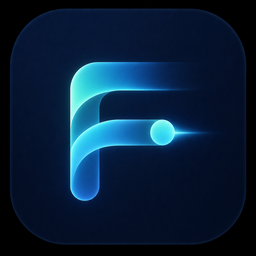
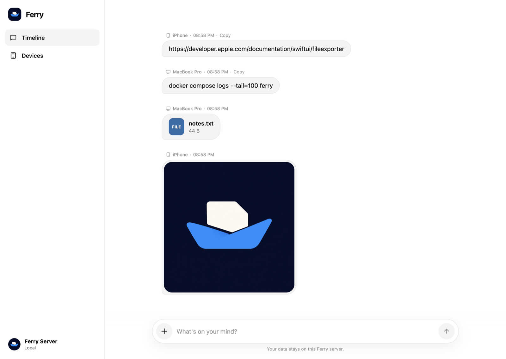

<div align="center">
  
  <h1>Ferry</h1>
  <p><strong>Your devices, one timeline, on your own network.</strong></p>
  <p>
    
    
    
    
    
  </p>
  <p><a href="#how-do-i-run-ferry"><strong>Run it with two commands</strong></a></p>
</div>

Ferry is a self-hosted clipboard and file ferry for the devices on one trusted local network. It looks like a chat: everything you send lands in a single timeline that every joined device can read, so moving a link from your phone to your laptop is a paste and a copy, not an email to yourself.

One Go process serves the Web app and the API, stores messages and device identities in SQLite, and keeps uploaded bytes in a local blob directory. Native iOS and Android apps read the same timeline as the browser. Nothing leaves the network you run it on, and there is no account to create.

<p align="center">
  
</p>

## Why not just message yourself?

Because the round trip is the cost. A self-chat in a messaging app sends your clipboard to somebody else's servers, compresses your screenshots, and needs an account on every device. AirDrop needs both devices awake, unlocked and in the same room, and it has no history to scroll back through.

| Area | Ferry behavior |
| --- | --- |
| Where content lives | One process you run, on hardware you own |
| Account | None; a device joins with an optional shared password and gets a revocable token |
| History | A persistent timeline, not a transfer that disappears when it lands |
| Files | Stored and served as uploaded, up to 64 MB, no re-encoding |
| Clipboard | Read and written only by your own paste shortcut and copy control |
| Network | Refuses to publish on a wildcard, hostname or public address |

## Features

- **A timeline, not a transfer.** Text, links and files stay in order, labelled with the device that sent them, and are still there tomorrow.
- **Images render inline.** Photos and screenshots appear in the message, open full screen on tap, and save to the device you are holding.
- **Your clipboard stays yours.** Ferry never reads or writes it in the background. You paste in with the system shortcut and take out with a copy control on the message.
- **Four surfaces, one server.** Web, iOS and Android all talk to the same Go process over the same documented HTTP API.
- **Revocable devices.** Every content, settings and device endpoint needs a device token you can revoke from any joined browser.
- **Private by construction.** No account, no telemetry, no third-party service, and no path off the local network.

## Requirements

- Docker with Compose v2 on the machine that will host Ferry, or Go 1.26.3 to run it from source
- A trusted private network; Ferry refuses to bind a wildcard, hostname or public address
- Optional: Xcode 26.6 for the iOS app, Android Studio with JDK 17 and SDK 35 for the Android app

## How do I run Ferry?

1. Publish Ferry on one specific private address and a high port:

   ```bash
   FERRY_HOST_IP=192.168.1.20 FERRY_PORT=42817 docker compose up --build -d
   docker compose logs ferry
   ```

2. Open `http://192.168.1.20:42817` on any device on that network. Compose defaults to `127.0.0.1:42817` unless `FERRY_HOST_IP` is supplied.

3. The first browser or App joins directly when no access password is configured. Any connected Web device can enable, change or disable the shared password in **Devices → Access password**. The password setting lives in Ferry's SQLite database, not in deployment configuration.

Keep Ferry on a trusted private network and do not expose it to the public Internet; see [Security](#security).

### Back up and restore

Build the image once, then use the data tool from the repository root:

```bash
scripts/ferry-data.sh backup ./ferry-backup-2026-08-31.tar.gz
scripts/ferry-data.sh restore ./ferry-backup-2026-08-31.tar.gz ./before-restore.tar.gz
```

The tool briefly stops a running Ferry service so SQLite and blobs are archived together. It refuses to call a snapshot successful if the volume contains unsupported entries. Restore validates a private copy of the archive, creates and validates the requested safety backup, replaces the named volume, and restarts Ferry only after a successful restore and only if it was running before the operation. A failed restore leaves the service stopped so partial data is not served. Copy backups away from the Server host; they contain messages, files, hashed device tokens and the password verifier.

Upgrade after taking a backup:

```bash
git pull --ff-only
docker compose build --pull ferry
docker compose up -d ferry
docker compose logs --tail=100 ferry
```

## Run from source

Requirements: Go 1.26.3 or newer.

```bash
go run ./cmd/ferry -listen 127.0.0.1:42817
```

For LAN access, use an explicit private address:

```bash
go run ./cmd/ferry -lan -listen 192.168.1.20:42817
```

By default local state is written to the ignored `./ferry-data` directory. Use `-data-dir` to choose another location.

## Native apps

### iOS

Open `ios/Ferry/Ferry.xcodeproj` in Xcode 26.6 or newer and run the `Ferry` scheme. Simulator builds need no Team; a physical device requires your Apple Development Team. Enter the Docker URL, a device name and the optional Web-configured password.

For an eventual archive, set the Team in Xcode and keep certificates/profiles outside Git:

```bash
xcodebuild archive -project ios/Ferry/Ferry.xcodeproj -scheme Ferry \
  -destination 'generic/platform=iOS' -archivePath /tmp/Ferry.xcarchive \
  DEVELOPMENT_TEAM=YOUR_TEAM_ID
```

Store export remains a maintainer-authorized step; this repository does not contain Apple credentials or an App Store export profile. When publication is explicitly authorized, copy `ios/ExportOptions.plist.example` to the ignored `ios/ExportOptions.plist`, replace `YOUR_TEAM_ID`, and pass that local file to `xcodebuild -exportArchive`.

### Android

Open `android/` in Android Studio, or build the debug APK with JDK 17 and Android SDK 35:

```bash
cd android
./gradlew :app:assembleDebug
```

The APK is produced below `android/app/build/outputs/apk/debug/`. To configure a signed release, copy `android/signing.properties.example` to the ignored `android/signing.properties`, restrict it to the current user, create the referenced keystore locally, and run `./gradlew :app:bundleRelease`. Any Gradle task graph that packages a release fails if signing configuration is absent or incomplete.

## Project status

Ferry is under active development and has no tagged release.

| Component | Current state |
| --- | --- |
| Server + Web | Go/SQLite MVP, deployed together with Docker Compose |
| iOS App | Native SwiftUI MVP for iOS 26 |
| Android App | Native Compose MVP for Android 8+; real-device install and launch confirmed |

Automatic discovery, clipboard synchronisation, background transfer, TLS/public-Internet exposure and store publication are not part of the current milestone.

## Development

Run the local gates that match your change:

```bash
scripts/check-repo.sh
go test -race -count=1 ./...
go vet ./...
node --check internal/webui/assets/app.js
docker compose config
(cd android && ./gradlew :app:testDebugUnitTest :app:lintDebug :app:assembleDebug)
xcodebuild test -project ios/Ferry/Ferry.xcodeproj -scheme Ferry \
  -destination 'platform=iOS Simulator,name=iPhone 17 Pro,OS=latest' \
  -only-testing:FerryTests \
  -derivedDataPath /tmp/FerryDerivedData
```

GitHub Actions runs these Server/Web, Android and iOS gates. See [CONTRIBUTING.md](CONTRIBUTING.md) before submitting a change. Product boundaries live in [docs/product-core.md](docs/product-core.md), while [api/openapi.yaml](api/openapi.yaml) is the HTTP contract.

## Security

Ferry uses unencrypted HTTP on a trusted LAN. Every content/settings/device endpoint requires a revocable device Bearer token; the optional shared password gates only new devices. Read [SECURITY.md](SECURITY.md) before deployment or vulnerability reporting.

## License

Ferry is licensed under the [Apache License 2.0](LICENSE).
