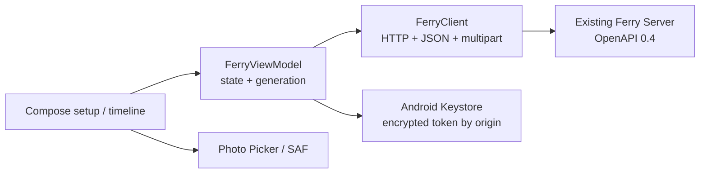

# Android native MVP

> English | [简体中文](android-mvp.zh-Hans.md)

## S0 — Confirmed scope

- **REQUESTED (Max, 2026-08-30)**: build the Android App that had not been developed yet; the build may use only the Android environment already on the test server, with no tools installed on the current Mac.
- **Target acceptance**: a real Android device connects to an existing Ferry Server, restores credentials, shows the timeline, sends and copies text, sends files from the photo picker or file chooser, and saves received files to a user-chosen location. Real-device APK install and launch have been confirmed by the user; the rest of the LAN journey is not yet done.
- **DESIGN_NECESSARY**: persist the Server origin and device name; persist the token encrypted with Android Keystore; otherwise the entry point or identity is lost after a restart.
- **DESIGN_NECESSARY**: a session generation plus coroutine cancellation isolates old connections, polling, sends and downloads; otherwise old tasks can write back after switching Servers or being revoked.
- **DESIGN_NECESSARY**: photos use the system Photo Picker, ordinary files use the Storage Access Framework and downloads use Create Document; otherwise broad storage permissions are needed or file sharing cannot be completed.
- **REPO_REQUIRED**: Jetpack Compose, Android native/AndroidX first, the same OpenAPI 0.4 contract, bounded tests, complete error states, adversarial self-review and an independent full-code review.
- **Decided (Max's revision to the scope card)**: install no JDK/SDK/Gradle on this machine; reuse the JDK 17, SDK/Build Tools 35 and Gradle 8.9 baseline in the test server's an earlier project's build directory.
- **Decided (Max did not object to the rest of the scope card and revised a single item)**: minimum Android 8 (API 26), compile/target API 35; no Play Store release for now.
- **Non-goals**: automatic clipboard watching, background transfer, mDNS/QR-code discovery, device management/password settings, TLS/public Internet, push notifications, an offline message database, Play Store release.
- **Depth**: full; a new native client and a cross-process user journey, without changing the Server, OpenAPI or SQLite.
- **Budget**: at most 20 production Kotlin/XML/Gradle files and 1,600 net new production lines; one Android application module, one Keystore credential mechanism, zero new Server/API/DB mechanisms.
- **Artifact budget**: this file is the only process record for S0–S7, at most 260 lines.
- **Boundary plan**: the test server runs assemble/lint/JVM tests; the real Server API provides supporting evidence; the Android device journey must use the real App. Install and launch have real-device evidence; the remaining LAN journey is marked `BLOCKED (external)` until the user is back on the home LAN and must not be replaced by unit tests.
- **Expansion triggers**: HALT if new tools, API changes, a background worker, a local database, a share extension or going over budget are needed.

Status: `device_launch_candidate`; subject: commit `888547f`; pending gate: real Android LAN journey; review round: 4 complete; invalidations: 19 builder/reviewer findings closed.

## S1 — Architecture decision

### Evidence and candidates

- **Observed**: the existing iOS client already proved the shape "one session state owner + a narrow hand-written HTTP client + a secure token store + generation/cancel"; Android should reuse the contract and lifecycle principles, not copy the Swift code structure.
- **Observed**: the test server has only API/Build Tools 35, JDK 17 and AGP 8.7.3 / Kotlin 2.0.21 / Gradle 8.9 caches, with no emulator or connected device.
- **Observed**: the Ferry API uses JSON, multipart and Bearer; Android's `HttpURLConnection`, `org.json` and ContentResolver are enough to implement it, with no need for Retrofit/OkHttp/a JSON generator.
- **Observed**: the official Android Photo Picker falls back to `ACTION_OPEN_DOCUMENT` on devices where it is unavailable; the Storage Access Framework can open and create files without requesting broad storage permissions.

1. **Selected — Compose + narrow platform client**: Compose UI, a StateFlow state owner, `HttpURLConnection`/`org.json`, Android Keystore and system pickers. The smallest dependency surface, with Ferry controlling its own contract and cancellation semantics.
2. **Rejected — Compose + Retrofit/OkHttp/serialization**: shorter code, but brings three long-lived third-party surfaces and an extra generated/reflection contract for six endpoints.
3. **Rejected — WebView wrapper**: the fastest way to show the existing Web app, but cannot deliver native secure storage, Photo Picker, Create Document or the Android lifecycle.

### Plain brief

The Android App is another native client of the existing Ferry Server and owns no message or account data. One state owner coordinates secure credentials, polling and user actions, and the system pickers grant access only to files the user explicitly chose. If this goes wrong, the most direct results are content sent to an old Server, still showing connected after revocation, or file access overreaching or failing while appearing to succeed.

### Authority and lifecycle

| Decision | Authority | Work identity | Opens | Closes |
| --- | --- | --- | --- | --- |
| current Server/session | normalized origin + Server `/session` | monotonic generation | connect/restore | address change, 401, disconnect |
| timeline | Server sequence | generation + cursor | connected | generation change |
| send completion | request job | generation + draft/file revision | user sends | response/error/cancel |
| selected file | ContentResolver URI metadata | selection revision | picker result | remove/success/session reset |
| download bytes | authenticated response | generation + message ID + destination URI | Create Document result | copy/error/cancel |

Counterexample: a poll or slow upload for Server A completes after the user has switched to Server B. Every session reset first increments the generation and cancels owned jobs; every result compares the generation before writing state, so A has no right to modify B.

### Rules and counterexamples

| Rule | Mechanism | Counterexample |
| --- | --- | --- |
| The token never enters plain preferences or logs | Keystore AES-GCM; prefs store only IV+ciphertext | A search for token value writers reaches only the cipher input |
| The origin is a single HTTP(S) origin | URI normalize/reject userinfo/path/query/fragment | `http://user@192.168.1.20/x?q=1` fails |
| The Android kind is reported explicitly | join header `X-Ferry-Device-Kind: android`, JSON unchanged | an old Server still accepts the two-field JSON |
| Unknown or mismatched messages fail closed | finite decoder validates the kind/payload pair | `kind:link` or text and file both present fails |
| Files are at most 64 MiB | metadata preflight + streaming byte counter | reported size 0 but an actual 64 MiB+1 still fails |
| User file access needs no broad permission | Photo Picker/OpenDocument/CreateDocument URI grants | the manifest contains no storage/media permission |
| Cleartext comes only from the Server the user entered | the UI states the HTTP LAN warning; the client never invents a remote origin | with no endpoint, every request fails closed |

## S2 — Frozen ship checklist

1. **REQUESTED** — the APK uses the Ferry icon, launches on API 26+, and setup takes Server/name/password and connects; the test server `assembleDebug` + real-device journey.
2. **REQUESTED** — the real timeline shows text/file and device icons; text can be copied; new messages appear after polling; real-device journey.
3. **REQUESTED** — a real device sends text, Photo Picker media and an OpenDocument file, and the Server API returns the exact sender/type/bytes; real-device journey.
4. **REQUESTED** — tapping a file saves it through CreateDocument, and the saved bytes equal the Server blob; real-device journey.
5. **DESIGN_NECESSARY** — endpoint/decode/error/credential/generation/revision/64 MiB/401 all have JVM contract tests; invalid input sends no request and leaves no false success.
6. **REPO_REQUIRED** — The test server assemble/test/lint, `git diff --check`, the attack record, self-review and an independent full-code review all pass; if there is still no device, the Android device journey stays `BLOCKED (external)` and the whole must not be declared a final SHIP.

Frozen journey: launch → enter `http://192.168.1.20:42817`, Android device name, optional password → connected timeline contains existing Mac/iPhone/Android rows → send exact text → pick one photo and one ordinary file → Web/API observes Android sender and exact bytes → save an existing file to a new document and compare bytes → revoke this Android device → next poll returns setup with visible revoked message.

## S3 — Builder attack record

| Pattern | Attack → outcome |
| --- | --- |
| two judges | OpenAPI/Go compared field by field with Kotlin for ID, kind, token and file URL; found that checking only the token's character length was insufficient, changed to a 32-byte canonical base64url round-trip and added a noncanonical fixture |
| extremes | 0, 64 MiB, 64 MiB+1, JSON six-byte escapes; page limit=2 + 2 MiB bound, draining immediately when the page is full and the cursor advances |
| spellings | origin case/default port/trailing slash, canonical/noncanonical token; endpoint and token tests pin a single form |
| defaults | missing/unknown kind, text+file, unknown file size; the decoder and stream counter both fail closed |
| side doors | forged `download_url`, metadata size spoofing, HTTP redirect; relative exact URL, actual byte counter, `instanceFollowRedirects=false` |
| policy gate | no broad storage permission is checked by APK `aapt dump permissions`; 64 MiB, credential and generation are checked by JVM tests |
| self certification | fake HTTP proves only the client mechanism and does not claim real-device completion; the real App journey remains explicitly `BLOCKED (external)` |

Confirmed counterexamples include automatic redirects, JSON wire expansion, local-send cursor skips, out-of-order picker callbacks, non-retrying restored sessions, blocking I/O cancellation, restore-job ABA, process/configuration recreation, API 35 insets/IME, hidden credential-removal failure, untracked CRLF checks, and the initially copied wrapper collapsing CLI arguments. Each logic class is now a test or mechanical gate. JDK HTTP test server unavailable on Android JVM test classpath was a harness finding only; an in-memory `HttpURLConnection` adds no product dependency.

## S4 — Author adversarial self-review

1. **Coupled state** — every read and write of generation/cursor/draftRevision/fileRevision and the five jobs lives in `FerryViewModel`; stale join, local-send cursor, selection order, restore retry/ABA and authenticated 401 all have gates.
2. **Failure paths** — join/poll/send/download/picker/credential exceptions all produce visible state; destination cleanup success/failure and 401 cleanup failure all have tests.
3. **Unchanged callers** — `rg FerryService|ServerEndpoint|ConnectionPhase` enumerates App, Activity and tests; Android is a new module, no replaced implementation.
4. **Contract surfaces** — OpenAPI/Go is unchanged; the Android request header/JSON, finite decoder, canonical token and exact download path are contract-tested.
5. **Original reproduction** — wire expansion derives a finite page from the server's 64 KiB×6 upper bound; default redirect, cursor skip, selection inversion and blocking cancel all have discriminating assertions.
6. **Current-HEAD journey** — build/test/lint evidence is current; the physical Android journey is unavailable and remains a hard external blocker.
7. **Mechanism discrimination** — the request fake records the Android header/body/auth and redirect setting in the same call; the download kill probe proves a mismatch deletes the output.
8. **Regression scan** — a 2 MiB/2-message escaped page remains bounded and drains without a fixed delay; the canonical token matches Go `RawURLEncoding` exactly; no broad permissions or backup.
9. **Scale/edge** — empty/error/full pages, maximal JSON escaping, no-progress full page, size mismatch, the 64 MiB stream gate, whitespace origin/name and duplicate messages are bounded or tested; a single self-host has no tenant boundary.
10. **Contract attacks** — all seven builder attacks are recorded above; confirmed logic findings are fossilized or mechanically gated.
11. **Predicate producers** — `isUnauthorized` only consumes typed HTTP 401; `kind` only comes from the finite decoder; session authority only from generation + encrypted token.
12. **Reversed findings** — N/A; no reviewer finding has been reversed.
13. **Pass limit** — the author pass did not certify itself; fresh full-code repair verification found P0/P1/P2 = 0, while real-device proof remains external.

## S5–S6 — Independent verification and machine evidence

- Fresh full-code verifier complete: P0 0, P1 0, P2 0 after four repair rounds. It read the complete Android module, OpenAPI and Go contract; no finding was accepted by assertion alone.
- The test server used only its pre-existing JDK 17, SDK/Build Tools 35 and Gradle cache. The final offline command `./gradlew :app:testDebugUnitTest :app:lintDebug :app:assembleDebug --offline --no-daemon --rerun-tasks` completed all 51 tasks.
- 28 JVM tests: Cipher 2, Client 8, JSON 5, ViewModel 10, Endpoint 3; 0 failure/error/skip. They include canonical credential, redirect kill, blocking-I/O cancel, 64 MiB+1 streamed upload, cleanup failure, cursor race, selection race, retry, 401 and lifecycle cases.
- Android lint: 0 errors, 7 warnings (pinned cached dependency updates, packaged license, launcher-shape guidance); Go `go test ./...` passed; tracked and untracked whitespace checks passed.
- APK: `com.max1874.ferry` v0.1.0, min API 26, target/compile API 35, only INTERNET plus AndroidX's non-exported receiver permission. SHA-256 `b11a4024a035d8c120104820154084d99f5e94d0d48942289b9360296d41720f`.
- Production budget: 16 Kotlin/XML/Gradle files and 1,599 lines; one App module, no Server/API/DB changes.

## S7 — Physical-device gate

- **Observed (Max, 2026-08-31)**: the APK has been installed on a real Android phone and the App opens normally. The real-device install and launch gate therefore passes.
- The user is currently not on the home LAN where the Ferry Server is deployed, so the connect/timeline/text/photo/file/save/revoke journey cannot yet be run. The remaining LAN journey therefore stays `BLOCKED (external)`; the current state is a test candidate that has passed real-device launch, not a final SHIP.
