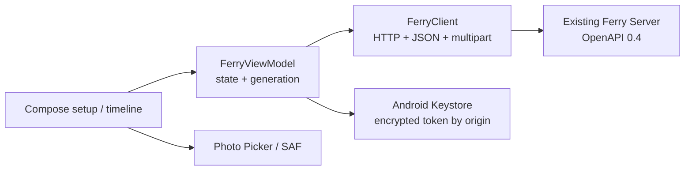

# Android 原生 MVP

> [English](android-mvp.md) | 简体中文

## S0 — Confirmed scope

- **REQUESTED（Max，2026-08-30）**：完成尚未开发的 Android App；构建环境只能使用测试服务器已有 Android 环境，不在当前 Mac 安装工具。
- **Target acceptance**：真实 Android 设备可连接现有 Ferry Server、恢复凭据、显示时间线、发送和复制文字、从相册或文件选择器发送文件，并把收到的文件保存到用户选择的位置；APK 真机安装与启动已由用户确认，其余局域网旅程尚未完成。
- **DESIGN_NECESSARY**：Server origin 与设备名持久化；token 使用 Android Keystore 加密后持久化；否则重启后入口或身份丢失。
- **DESIGN_NECESSARY**：会话 generation 与 coroutine cancellation 隔离旧连接、轮询、发送和下载；否则切换 Server 或被撤销后旧任务可回写。
- **DESIGN_NECESSARY**：照片使用系统 Photo Picker、普通文件使用 Storage Access Framework、下载使用 Create Document；否则需要宽泛存储权限或不能完成文件共享。
- **REPO_REQUIRED**：Jetpack Compose、Android 原生/AndroidX 优先、同一 OpenAPI 0.4 合约、有限测试、完整错误状态、攻击式自审和独立完整代码复核。
- **Decided（Max 对 scope card 的修订）**：本机不安装 JDK/SDK/Gradle；复用测试服务器上一个早期项目构建目录中的 JDK 17、SDK/Build Tools 35、Gradle 8.9 基线。
- **Decided（Max 对其余 scope card 未反对并修订单一项）**：最低 Android 8（API 26），compile/target API 35；当前不开 Play Store 发布。
- **Non-goals**：自动监听剪贴板、后台传输、mDNS/二维码发现、设备管理/密码设置、TLS/public Internet、推送通知、离线消息数据库、Play Store 发布。
- **Depth**：full；新增原生客户端和跨进程用户旅程，但不修改 Server、OpenAPI 或 SQLite。
- **Budget**：最多 20 个 production Kotlin/XML/Gradle files、production 净新增 1,600 行；一个 Android application module、一个 Keystore credential mechanism、零新增 Server/API/DB mechanism。
- **Artifact budget**：本文件是 S0–S7 唯一过程记录，最多 260 行。
- **Boundary plan**：测试服务器完成 assemble/lint/JVM tests；真实 Server API 提供支持证据；Android 设备旅程必须使用真实 App。安装与启动已有真机证据；其余 LAN 旅程在用户回到家庭局域网前标记 `BLOCKED (external)`，不得由单测替代。
- **Expansion triggers**：需要安装新工具、修改 API、后台 worker、本地数据库、分享扩展或超过预算时 HALT。

Status: `device_launch_candidate`; subject: commit `888547f`; pending gate: real Android LAN journey; review round: 4 complete; invalidations: 19 builder/reviewer findings closed.

## S1 — Architecture decision

### Evidence and candidates

- **Observed**：现有 iOS client 已证明“一个会话状态所有者 + 窄手写 HTTP client + 安全 token store + generation/cancel”的形状；Android 应复用契约与生命周期原则，不复制 Swift 代码结构。
- **Observed**：测试服务器只有 API/Build Tools 35、JDK 17、AGP 8.7.3 / Kotlin 2.0.21 / Gradle 8.9 缓存，没有 emulator 或连接设备。
- **Observed**：Ferry API 使用 JSON、multipart 和 Bearer；Android 平台的 `HttpURLConnection`、`org.json` 与 ContentResolver 足以实现，不需要 Retrofit/OkHttp/JSON generator。
- **Observed**：Android 官方 Photo Picker 在不可用设备上回退到 `ACTION_OPEN_DOCUMENT`；Storage Access Framework 可在不申请宽泛存储权限时打开/创建文件。

1. **Selected — Compose + narrow platform client**：Compose UI、StateFlow state owner、`HttpURLConnection`/`org.json`、Android Keystore、system pickers。依赖面最小，契约和取消语义由 Ferry 自己控制。
2. **Rejected — Compose + Retrofit/OkHttp/serialization**：代码更短，但为六个 endpoint 引入三套长期第三方 surface 和额外 generated/reflection contract。
3. **Rejected — WebView wrapper**：最快显示现有 Web，但不能交付原生安全存储、Photo Picker、Create Document 与 Android 生命周期。

### Plain brief

Android App 是现有 Ferry Server 的另一位原生客户端，不拥有消息或账户数据。一个状态所有者协调安全凭据、轮询和用户操作，系统选择器只授予用户明确选中的文件访问权。如果这里出错，最直接的结果是内容发到旧 Server、撤销后仍显示已连接，或文件访问越界/失败却看似成功。

### Authority and lifecycle

| Decision | Authority | Work identity | Opens | Closes |
| --- | --- | --- | --- | --- |
| current Server/session | normalized origin + Server `/session` | monotonic generation | connect/restore | address change, 401, disconnect |
| timeline | Server sequence | generation + cursor | connected | generation change |
| send completion | request job | generation + draft/file revision | user sends | response/error/cancel |
| selected file | ContentResolver URI metadata | selection revision | picker result | remove/success/session reset |
| download bytes | authenticated response | generation + message ID + destination URI | Create Document result | copy/error/cancel |

Counterexample: Server A 的轮询或慢上传在用户切到 Server B 后完成。每次 session reset 先增加 generation 并取消 owned jobs；每个结果写状态前比较 generation，因此 A 无权修改 B。

### Rules and counterexamples

| Rule | Mechanism | Counterexample |
| --- | --- | --- |
| token 不进入明文 preferences/log | Keystore AES-GCM；prefs 只存 IV+ciphertext | 搜索 token value writer 只能到 cipher input |
| origin 是单一 HTTP(S) origin | URI normalize/reject userinfo/path/query/fragment | `http://user@192.168.1.20/x?q=1` 失败 |
| Android 类型显式报告 | join header `X-Ferry-Device-Kind: android`，JSON 保持不变 | old Server 仍接受两字段 JSON |
| unknown/mismatched message fail closed | finite decoder validates kind/payload pair | `kind:link` 或 text+file 同时存在失败 |
| 文件最多 64 MiB | metadata preflight + streaming byte counter | reported size 0 but actual 64 MiB+1 仍失败 |
| 用户文件访问无需宽泛权限 | Photo Picker/OpenDocument/CreateDocument URI grants | manifest 不含 storage/media permission |
| cleartext 只来自用户输入的 Server | UI 明示 HTTP LAN warning；client never invents remote origin | 没有 endpoint 时任何 request 失败关闭 |

## S2 — Frozen ship checklist

1. **REQUESTED** — APK 使用 Ferry icon，可在 API 26+ 启动，setup 输入 Server/name/password 并连接；测试服务器 `assembleDebug` + real-device journey。
2. **REQUESTED** — 真实时间线显示 text/file 和设备图标；文字可复制；poll 后新增消息出现；real-device journey。
3. **REQUESTED** — 真实设备发送 text、Photo Picker media 和 OpenDocument file，Server API 返回 exact sender/type/bytes；real-device journey。
4. **REQUESTED** — 点击 file 通过 CreateDocument 保存，保存 bytes 与 Server blob 相等；real-device journey。
5. **DESIGN_NECESSARY** — endpoint/decode/error/credential/generation/revision/64 MiB/401 均有 JVM contract tests；invalid input 不发 request、不留假成功。
6. **REPO_REQUIRED** — 测试服务器 assemble/test/lint、`git diff --check`、attack record、自审、独立 full-code review 全部通过；Android device journey 若仍无设备则保持 `BLOCKED (external)`，整体不得宣称最终 SHIP。

Frozen journey: launch → enter `http://192.168.1.20:42817`, Android device name, optional password → connected timeline contains existing Mac/iPhone/Android rows → send exact text → pick one photo and one ordinary file → Web/API observes Android sender and exact bytes → save an existing file to a new document and compare bytes → revoke this Android device → next poll returns setup with visible revoked message.

## S3 — Builder attack record

| Pattern | Attack → outcome |
| --- | --- |
| two judges | OpenAPI/Go 与 Kotlin 对 ID、kind、token、file URL 逐字段比对；发现 token 只做字符长度检查不够，改为 32-byte canonical base64url round-trip 并加 noncanonical fixture |
| extremes | 0、64 MiB、64 MiB+1、JSON six-byte escapes；page limit=2 + 2 MiB bound，并在满页且 cursor 前进时立即 drain |
| spellings | origin case/default port/trailing slash、canonical/noncanonical token；endpoint 与 token tests 固化单一形式 |
| defaults | missing/unknown kind、text+file、unknown file size；decoder/stream counter 均 fail closed |
| side doors | forged `download_url`、metadata size 欺骗、HTTP redirect；relative exact URL、actual byte counter、`instanceFollowRedirects=false` |
| policy gate | no broad storage permission 由 APK `aapt dump permissions` 检查；64 MiB、credential、generation 由 JVM tests 检查 |
| self certification | fake HTTP 只证明客户端 mechanism，不宣称真机完成；真实 App journey 仍明确 `BLOCKED (external)` |

Confirmed counterexamples include automatic redirects, JSON wire expansion, local-send cursor skips, out-of-order picker callbacks, non-retrying restored sessions, blocking I/O cancellation, restore-job ABA, process/configuration recreation, API 35 insets/IME, hidden credential-removal failure, untracked CRLF checks, and the initially copied wrapper collapsing CLI arguments. Each logic class is now a test or mechanical gate. JDK HTTP test server unavailable on Android JVM test classpath was a harness finding only; an in-memory `HttpURLConnection` adds no product dependency.

## S4 — Author adversarial self-review

1. **Coupled state** — generation/cursor/draftRevision/fileRevision 与五个 jobs 的全部读写在 `FerryViewModel`；stale join、local-send cursor、selection order、restore retry/ABA 与 authenticated 401 均有 gate。
2. **Failure paths** — join/poll/send/download/picker/credential exceptions all produce visible state；destination cleanup success/failure、401 cleanup failure 均有 tests。
3. **Unchanged callers** — `rg FerryService|ServerEndpoint|ConnectionPhase` enumerates App、Activity、tests；Android is a new module, no replaced implementation。
4. **Contract surfaces** — OpenAPI/Go is unchanged；Android request header/JSON, finite decoder, canonical token and exact download path are contract-tested。
5. **Original reproduction** — wire expansion 以 server 64 KiB×6 上界反推有限 page；default redirect、cursor skip、selection inversion 与 blocking cancel 都有 discriminating assertion。
6. **Current-HEAD journey** — build/test/lint evidence is current；physical Android journey is unavailable and remains a hard external blocker。
7. **Mechanism discrimination** — request fake records Android header/body/auth and redirect setting in the same call；download kill probe proves mismatch deletes output。
8. **Regression scan** — 2 MiB/2-message escaped page remains bounded and drains without fixed delay；canonical token matches Go `RawURLEncoding` exactly；no broad permissions or backup。
9. **Scale/edge** — empty/error/full pages, maximal JSON escaping, no-progress full page, size mismatch, 64 MiB stream gate, whitespace origin/name and duplicate messages are bounded or tested；single self-host has no tenant boundary。
10. **Contract attacks** — all seven builder attacks are recorded above；confirmed logic findings are fossilized or mechanically gated。
11. **Predicate producers** — `isUnauthorized` only consumes typed HTTP 401; `kind` only comes from finite decoder; session authority only from generation + encrypted token。
12. **Reversed findings** — N/A; no reviewer finding has been reversed。
13. **Pass limit** — author pass did not certify itself；fresh full-code repair verification found P0/P1/P2 = 0, while real-device proof remains external。

## S5–S6 — Independent verification and machine evidence

- Fresh full-code verifier complete: P0 0、P1 0、P2 0 after four repair rounds. It read the complete Android module, OpenAPI and Go contract; no finding was accepted by assertion alone.
- The test server used only its pre-existing JDK 17、SDK/Build Tools 35 and Gradle cache. Final offline command `./gradlew :app:testDebugUnitTest :app:lintDebug :app:assembleDebug --offline --no-daemon --rerun-tasks` completed all 51 tasks.
- 28 JVM tests: Cipher 2、Client 8、JSON 5、ViewModel 10、Endpoint 3；0 failure/error/skip. They include canonical credential, redirect kill, blocking-I/O cancel, 64 MiB+1 streamed upload, cleanup failure, cursor race, selection race, retry, 401 and lifecycle cases.
- Android lint: 0 errors、7 warnings（pinned cached dependency updates, packaged license, launcher-shape guidance）；Go `go test ./...` passed；tracked and untracked whitespace checks passed。
- APK: `com.max1874.ferry` v0.1.0, min API 26, target/compile API 35, only INTERNET plus AndroidX's non-exported receiver permission. SHA-256 `b11a4024a035d8c120104820154084d99f5e94d0d48942289b9360296d41720f`.
- Production budget: 16 Kotlin/XML/Gradle files and 1,599 lines; one App module, no Server/API/DB changes.

## S7 — Physical-device gate

- **Observed（Max，2026-08-31）**：APK 已安装到真实 Android 手机，App 可以正常打开。由此，真机安装与启动门槛通过。
- 用户当前不在部署 Ferry Server 的家庭局域网内，尚不能执行 connect/timeline/text/photo/file/save/revoke 旅程。因此剩余 LAN 旅程仍为 `BLOCKED (external)`，当前状态是已通过真机启动的测试候选版本，不是最终 SHIP。
