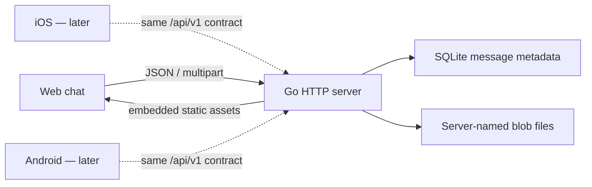

# Ferry 第一纵切架构

## 三句话说明

本里程碑只触碰 Ferry 的 Server、持久化协议和内嵌 Web，让用户启动一个程序后即可发送文字与文件。Server 把消息元数据写入 SQLite，把文件内容写入由服务端命名的 blob 目录，再向所有未来客户端提供同一 HTTP 合约。如果边界设计错误，最直接的后果是文件越权读取、跨端消息解释不一致，或重启后历史丢失。

## 最薄真实结构

## 问题与证据

1. **Observed**：仓库当前只有协作说明，没有任何应用、协议或部署结构。
2. **Decided（Max，2026-08-29）**：最终产品有 iOS、Android、自托管 Web 和自托管 Server。
3. **Decided（Max，2026-08-29）**：第一纵切通过真实 Server + Web 证明文本、文件、时间线、下载和重启持久化。
4. **Inferred**：四个运行时需要一个明确、语言无关的协议；若先各自发明模型，第二个客户端会成为不兼容的重写。
5. **Inferred**：没有鉴权的 Server 若默认监听局域网地址，会让同网段任意设备读写历史，因此第一纵切必须默认只监听 loopback。

## 候选方案

### A. Go 单进程 + SQLite + 内嵌 Web

- **Recommended**：一个可执行程序同时提供 API 和 Web；SQLite 保存元数据，磁盘目录保存文件。
- 优点：用户只部署一个服务；空闲资源低；备份边界直观；移动端共享一个窄 HTTP 合约。
- 代价：需要严格处理 SQLite 与 blob 文件的双写失败；Web 第一版不使用大型组件生态。

### B. Node + React + PostgreSQL

- 优点：Web 工具链成熟，实时 UI 扩展方便。
- 代价：用户至少管理 Node 依赖、Web build 和数据库；与“局域网小工具的一次部署”不相称。
- **Rejected**：第一纵切不需要它的运维和依赖面。

### C. 设备间点对点 + Web 只做发现

- 优点：可以没有中心历史服务。
- 代价：后台生命周期、NAT/发现、跨平台传输与离线历史一起成为第一阶段问题；也偏离已确认的 self-host Server。
- **Rejected**：不能以更薄机制满足已确认结构。

## 决策

- **Decided（Max，2026-08-29）**：用户确认 scope card 中的候选 A。
- **Decided**：本纵切只有一个默认空间，消息由用户主动发送。
- **Decided**：未实现鉴权前只允许监听 localhost 或 loopback IP；`-listen` 可以改端口或选择其他 loopback 地址，但不能开放到局域网。
- **Recommended**：下一纵切先设计配对与鉴权，再开放 LAN 默认体验和移动客户端。

## 数据与 I/O 保证

| 规则 | 机制 | 反例与检查 |
| --- | --- | --- |
| 客户端文件名不能决定磁盘路径 | blob 名由 128-bit 随机 ID 生成；下载按消息 ID 查库 | 上传文件名 `../../ferry.db`，只能作为显示名返回 |
| 单文件最大 64 MiB | HTTP request cap + 文件流计数双门 | 64 MiB + 1 byte 返回 `payload_too_large` |
| 文本最大 64 KiB 且不能全空白 | 在消息构造边界按 UTF-8 byte 数与 trim 判定 | `" \n "` 被拒绝；原始非空文本不被 trim 改写 |
| 游标不会受同毫秒消息碰撞影响 | SQLite 自增 `sequence` 是唯一排序与 `after` 游标 | 同一时刻两条消息仍按不同 sequence 返回 |
| 未知消息种类失败关闭 | DB scan 与 API serializer 只接受 `text` / `file` | 人工插入 `kind=link` 后 list 返回内部错误而非伪造消息 |
| DB 写失败不留下可访问消息 | blob 用随机服务端名称和 `O_EXCL` 创建，DB 成功前 API 无入口；插入失败删除 blob | 关闭 DB 后上传，接口失败且 blob 被清理 |
| Server 重启后历史保留 | SQLite 与 blob 都位于显式 data directory | 关闭后用同一 data dir 启动，消息和下载仍可读 |
| 未鉴权服务只能位于 loopback，且不接受网页跨站写入或 DNS rebinding Host | 启动配置拒绝非 loopback 监听；所有 Host 限定为 localhost/loopback；带 Origin 的写请求必须同源 | `-listen 0.0.0.0:8080` 启动失败；`Host: evil.example` 返回 421；跨站 POST 返回 403 |

崩溃发生在 blob 完成写入、关闭与 SQLite insert 之间时可能留下不可访问的孤儿 blob；第一纵切不承诺崩溃原子性。后续可增加启动清扫，但不扩大本次范围。

## API 合约

机器可读版本在 `api/openapi.yaml`，所有客户端以它为边界。

- `GET /api/v1/messages?after=<sequence>&limit=<1...200>`
- `POST /api/v1/messages/text`，JSON：`sender_name`、`text`
- `POST /api/v1/messages/file`，multipart：`sender_name`、`file`
- `GET /api/v1/files/{message_id}`
- `GET /healthz`

消息是以 `kind` 判别的联合：`text` 只带 `text`，`file` 只带 `file` 对象。时间为 UTC RFC 3339、最多纳秒精度；跨端只把它当时间戳，不从字符串精度推导身份或顺序。

## 第一位消费者：真实用户旅程

前置期望：Server 使用临时 data directory，浏览器打开 Server 根页面，时间线为空。

1. 用户在 composer 输入 `hello ferry` 并发送；页面出现一条 sender 为 `Web`、正文完全相同的 text 消息。
2. 用户选择内容为 `ferry file\n`、显示名为 `hello.txt` 的文件；页面出现 file 消息，大小与名称正确。
3. 用户点击该文件；下载响应正文逐字节等于 `ferry file\n`。
4. 关闭 Server，再以同一 data directory 启动；刷新浏览器，两条消息仍在且文件仍能下载。
5. 失败探针：以 64 MiB + 1 byte 文件上传；页面必须显示错误，时间线不新增消息。

## Walking skeleton

1. 冻结 OpenAPI 判别联合和错误形状。
2. 建 SQLite schema、blob store 与 HTTP 边界测试。
3. 接入内嵌 Web，先发送文本，再扩展文件。
4. 启动真实服务，用真实浏览器重放上述旅程。
