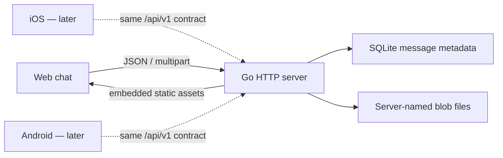

# Ferry first vertical slice architecture

> English | [简体中文](architecture.zh-Hans.md)

## In three sentences

This milestone touches only Ferry's Server, persistence protocol and embedded Web app, so that a user can start one program and send text and files. The Server writes message metadata to SQLite and file content into a blob directory whose names the Server chooses, then offers the same HTTP contract to every future client. If the boundaries are designed wrongly, the most direct consequences are unauthorised file reads, clients interpreting messages inconsistently, or history lost after a restart.

## Thinnest real structure

## Problem and evidence

1. **Observed**: the repository currently holds only collaboration notes, with no application, protocol or deployment structure.
2. **Decided (Max, 2026-08-29)**: the final product has iOS, Android, a self-hosted Web app and a self-hosted Server.
3. **Decided (Max, 2026-08-29)**: the first vertical slice proves text, files, the timeline, downloads and persistence across restart through a real Server plus Web app.
4. **Inferred**: four runtimes need one explicit, language-neutral protocol; if each invents its own model first, the second client becomes an incompatible rewrite.
5. **Inferred**: a Server without authentication that listens on a LAN address by default lets any device on the subnet read and write history, so the first slice must listen only on loopback by default.

## Candidates

### A. Single Go process + SQLite + embedded Web

- **Recommended**: one executable serves both the API and the Web app; SQLite stores metadata and a disk directory stores files.
- Pros: the user deploys one service; idle resources are low; the backup boundary is obvious; mobile clients share one narrow HTTP contract.
- Cost: the dual-write failure between SQLite and blob files must be handled strictly; the first Web version does not use a large component ecosystem.

### B. Node + React + PostgreSQL

- Pros: mature Web tooling, easy to extend with real-time UI.
- Cost: the user manages at least Node dependencies, a Web build and a database; out of proportion to "one deployment of a small LAN tool".
- **Rejected**: the first slice does not need its operational and dependency surface.

### C. Device-to-device peer-to-peer + Web for discovery only

- Pros: no central history service is needed.
- Cost: background lifecycle, NAT/discovery, cross-platform transfer and offline history all become first-stage problems; it also departs from the confirmed self-hosted Server.
- **Rejected**: it cannot satisfy the confirmed structure with a thinner mechanism.

## Decisions

- **Decided (Max, 2026-08-29)**: the user confirmed candidate A in the scope card.
- **Decided**: this slice has a single default space, and messages are sent deliberately by the user.
- **Decided**: until authentication exists, the Server may listen only on localhost or a loopback IP; `-listen` may change the port or choose another loopback address, but cannot open to the LAN.
- **Recommended**: the next slice designs pairing and authentication first, before opening a LAN default experience and mobile clients.

## Data and I/O guarantees

| Rule | Mechanism | Counterexample and check |
| --- | --- | --- |
| A client file name cannot decide a disk path | Blob names come from a 128-bit random ID; downloads look up the database by message ID | An upload named `../../ferry.db` can only come back as a display name |
| A single file is at most 64 MiB | HTTP request cap + stream byte counter, two gates | 64 MiB + 1 byte returns `payload_too_large` |
| Text is at most 64 KiB and cannot be all whitespace | Decided at the message construction boundary by UTF-8 byte count and trim | `" \n "` is rejected; non-empty original text is not rewritten by trim |
| The cursor is unaffected by messages colliding in the same millisecond | SQLite auto-increment `sequence` is the unique order and `after` cursor | Two messages at the same instant still come back with different sequences |
| Unknown message kinds fail closed | DB scan and API serializer accept only `text` / `file` | After manually inserting `kind=link`, list returns an internal error instead of a fabricated message |
| A failed DB write leaves no reachable message | Blobs are created with a random server name and `O_EXCL`, the API has no route to them before the DB succeeds, and a failed insert deletes the blob | Upload after closing the DB: the request fails and the blob is cleaned up |
| History survives a Server restart | SQLite and blobs both live in an explicit data directory | Restart with the same data dir: messages and downloads are still readable |
| An unauthenticated service stays on loopback and accepts neither cross-site writes nor DNS-rebinding Hosts | Startup configuration rejects non-loopback listeners; every Host is limited to localhost/loopback; write requests carrying an Origin must be same-origin | `-listen 0.0.0.0:8080` fails to start; `Host: evil.example` returns 421; a cross-site POST returns 403 |

A crash between the blob finishing its write and close and the SQLite insert can leave an unreachable orphan blob; the first slice does not promise crash atomicity. A startup sweep can be added later without widening this scope.

## API contract

The machine-readable version is `api/openapi.yaml`, and every client treats it as the boundary.

- `GET /api/v1/messages?after=<sequence>&limit=<1...200>`
- `POST /api/v1/messages/text`, JSON: `sender_name`, `text`
- `POST /api/v1/messages/file`, multipart: `sender_name`, `file`
- `GET /api/v1/files/{message_id}`
- `GET /healthz`

A message is a union discriminated by `kind`: `text` carries only `text`, `file` carries only a `file` object. Times are UTC RFC 3339 with up to nanosecond precision; clients treat them only as timestamps and never derive identity or order from the precision of the string.

## First consumer: the real user journey

Precondition: the Server uses a temporary data directory, the browser opens the Server's root page, and the timeline is empty.

1. The user types `hello ferry` in the composer and sends it; the page shows one text message with sender `Web` and exactly the same body.
2. The user selects a file with content `ferry file\n` and display name `hello.txt`; the page shows a file message with the correct size and name.
3. The user clicks the file; the download body equals `ferry file\n` byte for byte.
4. Stop the Server and start it again with the same data directory; after refreshing the browser both messages are still there and the file still downloads.
5. Failure probe: upload a 64 MiB + 1 byte file; the page must show an error and the timeline gains no message.

## Walking skeleton

1. Freeze the OpenAPI discriminated union and error shape.
2. Build the SQLite schema, blob store and HTTP boundary tests.
3. Wire in the embedded Web app, sending text first and then extending to files.
4. Start the real service and replay the journey above in a real browser.
