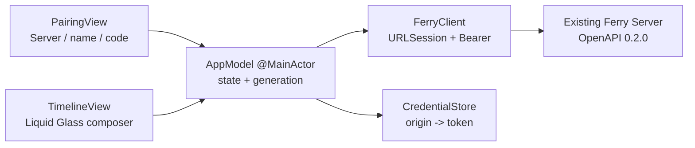

# iOS 原生纵切（历史实现记录）

> 本文中的准入流程已在 2026-08-30 被 `docs/password-access.md` 取代；当前 App 使用直接连接与可选共享密码。

状态：`implemented — verified`
确认依据：Max 在 2026-08-30 对 iOS 范围卡回复 `go`，随后明确要求最低 iOS 26，并默认使用 Liquid Glass。

## S0 — Confirmed scope

- **REQUESTED**：继续下一阶段，创建 Ferry iOS App；最低 iOS 26，默认使用 Liquid Glass。
- **Done**：用户在真实 iOS Simulator 中手动输入 Ferry Server 地址和配对码，进入原生时间线，发送文字与一个文件；Server 撤销该设备后，App 回到配对状态并显示原因。
- **DESIGN_NECESSARY**：设备 token 存 Keychain、Server URL 存 UserDefaults；否则重启 App 后身份或入口丢失。
- **DESIGN_NECESSARY**：Server/credential 切换以 generation + task cancellation 隔离；否则旧 poll/send 可覆盖新会话。
- **DESIGN_NECESSARY**：允许 local-network HTTP，并声明本地网络用途；否则当前可信 LAN Server 无法从 iOS 访问。
- **REPO_REQUIRED**：SwiftUI、Apple 原生框架、file-system synchronized Xcode project、独立 DerivedData、单一 Simulator、单元测试、真实 Server + Simulator 旅程、自审与独立 review。
- **Decided（Max）**：iOS 26；Liquid Glass 是默认视觉，不维护 iOS 17–25 fallback。
- **Decided（Max via scope `go`）**：无第三方依赖；Team 留空；临时 Bundle ID `com.max1874.ferry`，发布身份以后再定。
- **Non-goals**：Android、自动发现、后台剪贴板、文件预览/下载、设备管理、TLS、公网连接、离线消息缓存、推送通知。
- **Depth**：full；新增原生 client 和跨进程用户旅程，但不改变既有 HTTP contract/schema/auth boundary。
- **Budget**：最多 10 个 production Swift files、净新增 800 行；一个 Xcode project、一个 unit-test target、一个 UI-test target；不新增持久化 schema 或第三方 package。
- **Artifact budget**：本文件承载 S0–S7；不创建第二份总结。
- **Execution budget**：只使用 1 个既有 Simulator，不创建/删除用户设备；验收后默认 commit + push。
- **Boundary plan**：unit tests 用 contract-aware URLProtocol fake 关闭 decode/error/race；真实 Go Server + iPhone 17 Pro Simulator + XCUITest 关闭用户可见 Done。
- **Expansion triggers**：API 变更、mDNS、TLS、后台任务、第二份本地数据库、分享扩展或超过预算触发 HALT。

## S1 — Architecture decision

### 三句话说明

这一阶段把现有 Ferry API 接到真正的 SwiftUI App：用户配对后，在一条原生聊天时间线发送文字和文件。Server 仍是消息与身份的唯一权威，iOS 只在 Keychain 保存按 Server origin 隔离的 token，并用一个会话 generation 阻止旧异步任务写入新状态。如果边界做错，用户会丢失身份、把内容发到错误 Server，或被撤销后仍看到假在线状态。

### Observed problems

1. **Observed**：仓库没有 Xcode project 或 Swift source，现有 AppIcon 资产只有 mac idiom，不能直接成为 iOS AppIcon。
2. **Observed**：API 已提供 public claim、Bearer session/messages/text/file；iOS 无需新增 Server endpoint。
3. **Observed**：Xcode 26.6 SDK 提供 `.glassEffect(...)`、`GlassEffectContainer`、`.buttonStyle(.glass/.glassProminent)`；本机有 iOS 26.5 runtime。
4. **Observed**：avocado/swipe 均使用 objectVersion 77 + file-system synchronized root group；Ferry 采用相同工程形状，但不复制其 Team、Bundle ID 或业务架构。

### Candidates

- **A — Native SwiftUI + handwritten narrow client（Selected）**：只实现本纵切使用的 5 个 API，模型与 OpenAPI exact keys 对齐。优点是没有生成器/依赖、错误与取消语义可控；代价是 API 扩展时要同步模型测试。
- **B — OpenAPI generated client（Rejected）**：减少长期手写，但本仓库没有 generator gate，首次引入会增加工具、生成物与 drift 机制，超过本纵切预算。
- **C — WKWebView wrapper（Rejected）**：最快看到现有 Web，但无法证明原生 Keychain、文件选择和 Liquid Glass 交互，也不构成 iOS 原生纵切。

### Authority and lifecycle

| Decision | Authority | Work identity | Ordering | Opens | Closes |
| --- | --- | --- | --- | --- | --- |
| 当前 Server | normalized origin in AppModel | session generation UUID | newest generation only | connect/pair | endpoint change |
| 当前身份 | Server `/session` + Keychain token | origin + token | 401 outranks older success | claim/session 200 | 401/disconnect |
| 时间线 | Server sequence/cursor | generation + cursor | ascending sequence | authenticated | generation change |
| send terminal state | request task + generation | generation + local send ID | current generation only | user submits | response/error/cancel |
| file bytes lifetime | security-scoped URL | one send task | task-owned | file selected/send | response/error/cancel |

Original counterexample：会话 A 的 poll 已发出，用户切到 Server B 并完成配对，A 随后返回 401/200。每次切换先递增 generation 并取消旧 task；任何 response 在改状态前比较 generation，不相等则丢弃，因此 A 无权清除或覆盖 B。

### Rules and counterexamples

| Rule | Mechanism | Counterexample |
| --- | --- | --- |
| token 不进 UserDefaults/log | Keychain CredentialStore 是唯一 token writer | 搜索 defaults/log 无 token key/value |
| origin 不得带 credential/path/query | URL normalization at construction | `http://user@10.0.0.1:8080/x?q=1` 被拒绝 |
| unknown message kind fail closed | custom Codable enum | `{kind:"link"}` decode 失败 |
| Server error 可观察 | decode API error, retain user-facing message | 401 → Pairing；503 → Offline/error，不是假成功 |
| 旧任务不能回写 | generation check before every mutation | A delayed result after switch B is ignored |
| file 受 64 MiB contract 限制 | preflight resource size + Server enforcement | 67,108,865-byte file client-side rejected |
| Liquid Glass 是结构而非装饰截图 | glass APIs on toolbar/composer/action controls | source/build gate 缺少 glass API 即失败 |

## S2 — Frozen ship checklist

| ID | Provenance | Finite property | Evidence |
| --- | --- | --- | --- |
| IOS-01 | REQUESTED | iOS 26 app project builds with supplied Ferry icon | `xcodebuild build` + installed app icon |
| IOS-02 | DESIGN_NECESSARY | origin validation, Codable contract, API errors and generation isolation | unit tests |
| IOS-03 | DESIGN_NECESSARY | token is origin-keyed in Keychain; URL persists without token leakage | unit tests + source search |
| IOS-04 | REQUESTED | real Simulator pairs with real Server and renders current device/timeline | XCUITest actual labels |
| IOS-05 | REQUESTED | real Simulator sends text and Server-backed timeline renders exact sender/body | XCUITest + Server response/history |
| IOS-06 | REQUESTED | real Simulator selects and sends a file; timeline renders exact name/size | XCUITest + Server history/blob bytes |
| IOS-07 | REQUESTED | Server revocation moves App to pairing with visible reason | real Server + XCUITest |
| IOS-08 | REQUESTED | iOS 26 Liquid Glass controls are present and interactive | source gate + Simulator screenshot/interaction |
| IOS-09 | REPO_REQUIRED | build/test/diff/self-review/fresh review all close on final subject | S3–S7 |

Frozen journey：empty data dir Server prints code → iPhone 17 Pro launches → user enters `http://<private-ip>:<port>`, `iPhone`, code → header shows `iPhone` → send `hello from iOS` → same row shows sender/body → attach `ios-fixture.txt` and send → row shows file name/byte count → another authenticated client revokes iPhone → next poll shows pairing screen and `This device is no longer paired.`

## S3 — Build and attack record

实现保持在预算内：9 个 production Swift files、721 行；无第三方 package。工程为 Xcode 26.6 / objectVersion 77 / file-system synchronized groups，deployment target 为 iOS 26.0；App icon 使用仓库根目录的用户提供图标生成 1024×1024 iOS asset。

构建阶段固化的反例：

- `try?` 可选值被二次绑定导致首次编译失败；删除重复绑定后同一 generic Simulator build 通过。
- 撤销后 `pollTask` 只 cancel 不清 owner，重新配对无法启动新 poll；`testPollingRestartsAfterRevocationAndRepair` 先红后绿。
- Server A 的迟到认证可能覆盖 Server B；`testStaleAuthenticationCannotReplaceNewPairing` 固化 generation gate。
- inactive 取消 poll 会被当作离线；`testBackgroundCancellationDoesNotTurnConnectedSessionOffline` 固化 CancellationError/URLError.cancelled 边界。
- host 大小写和默认端口会把同一 origin 分成多个 Keychain account；endpoint tests 固化小写 host 与 80/443 归一化。
- 文件发送会清掉已有文字草稿；`testSendingFilePreservesExistingTextDraft` 固化“文件发送不消费草稿”。
- Keychain 保存错误会被 refresh 清掉；独立 `credentialWarning` 持久显示，`testCredentialSaveFailureRemainsVisibleWhileConnected` 固化。
- 发送错误与连接错误共用状态会被健康 poll 擦掉；独立 `sendError` 固化失败保留，离线态提供 Change Server 逃生口。
- 会话切换只隔离旧回写却不停止旧 I/O；model 持有 send task，reset/inactive 取消，文件按 256 KiB 分块并在每块间检查取消和 64 MiB 上限。
- 慢发送成功会清掉之后的新草稿/附件；最终使用彼此独立、单调递增的 draft/file revision，关闭不同值、ABA 相同值及跨字段交错。
- 公共 pairing claim 的 401 曾被误判成已认证设备撤销；客户端现在只对带 Bearer 的 401 产生 unauthorized，公开 claim 保留 Server 的 `invalid_pairing_code` 文案。

七类协议攻击：

| Pattern | Attack | Outcome / gate |
| --- | --- | --- |
| Two judges | OpenAPI 路径/方法/Bearer/query 与 Swift request；Server 返回与 Codable | URLProtocol 精确断言请求，真实 Server journey 解码成功；客户端刻意容忍未知 response key，但 discriminator/payload invariant 更严格 |
| Extremes | 空 page、unknown/mismatched kind、64 MiB + 1 | decoder/empty poll tests；oversized sparse file 在选择边界失败 |
| Equivalent spellings | `HTTPS://Example.COM:443/`、`:80` | 均规范成小写、移除默认端口的单一 origin |
| Defaults | 默认 Server、缺失/未知 kind、nil file/text | UI journey 真实重输默认 origin；unknown/mismatched payload fail closed |
| Side doors | 直接构造伪造 `SelectedFile(size: 0)` 绕过 selection preflight | `FerryClient` 按真实 bytes 二次检查，测试禁止请求抵达 URLProtocol |
| Policy needs a gate | iOS 26、Liquid Glass、10 files/800 LOC、无 package | pbx/source/LOC search + build/test commands；任何漂移产生可见 diff 或编译失败 |
| No self-certification | App 自己显示“发成功”不算证据 | Owner API 读取 exact sender/text/file，下载 blob 与 fixture `cmp=0`，Owner DELETE 204 后 XCUITest 等到真实 401 UI |

已知有界风险：文件读取已分块且可取消，但 MVP 仍为最多 64 MiB 的内存 multipart body；上限由客户端与 Server 双重关闭，这一阶段没有 streaming upload。TLS、后台传输和下载不在本范围。

## S4 — Adversarial self-review

结论：作者侧 gate **PASS**。按 1–13 顺序记录：

1. Coupled state — `generation/token/endpoint/cursor/pollTask/sendTask/isActive/isSending/selectedFile/draftRevision/fileRevision/status` 全量追踪；poll repair、stale auth、inactive cancellation、composer ABA/cross-field 均有命名单测。
2. Failure paths — 401、API rejection、invalid decode、Keychain read/save、cancel、oversize 均可观察或显式忽略取消；对应 tests + real revoke journey。
3. Unchanged callers — `rg 'FerryServicing|CredentialStoring|ServerEndpoint|setActive' ios/Ferry` 只命中 App、唯一 model、test seams，无第二调用方。
4. Contract surfaces — 未改 Server/OpenAPI/DB；URLProtocol 断言 `/messages?after=7&limit=200` 与 Bearer，真实 0.2.0 Server 完成 claim/text/file/session。
5. Fix reproduction — poll restart 用例修复前唯一失败、修复后全套通过；首次 Swift compile error 的同一 build 后续通过。
6. Current-HEAD journey — 所有 production 修复后，以 ad-hoc signed iPhone 17 Pro/iOS 26.5 重放；Server sequence 11 text、12 file，exact sender `iPhone UI Test`，下载 bytes `cmp=0`，DELETE 204，XCUITest 1/1、exit 0。
7. Mechanism discrimination — 使用真实 Keychain round-trip；去掉 signing 的 kill probe 返回 `-34018` 且新 warning 可见，不再把模拟失败当 Keychain 成功。
8. Regression scan — 候选为 warning 遮住 revoke、file 发送丢 draft、取消变 offline；分别用独立 warning/reset、draft test、cancellation test关闭。
9. Scale/edge — empty timeline、duplicate append、64 MiB + 1、伪造 size side door、invalid origin/kind 覆盖；streaming 明确留作后续。
10. Contract attacks — 本文件 S3 七类表逐项记录 attack 与 gate。
11. Predicate producers — `phase/statusMessage/credentialWarning/ClientError.unauthorized` 的所有 producer 经 `rg` 审阅；只有 HTTP 401 产生 unauthorized，warning 不参与 auth phase。
12. Reversed findings — Keychain `-34018` 不是产品成功：改用 ad-hoc signing + 真实 round-trip；Files fixture 不是缺失而是 iOS 26 Cell identifier，最终按 Cell 选择且 Server blob 证明。
13. Pass limit — 本记录只作为 author pre-filter；S5 fresh verifier 是最终独立 gate。

## S5/S6 — Independent verification

Fresh zero-context verifier `/root/ios_fresh_review` 对完整源码连续攻击，先后给出并推动关闭：发送错误被 poll 擦除、离线无换站入口、security scope 太晚、旧 send 未取消、慢发送覆盖新 composer、相同值 ABA、文字/附件共用 revision 的跨字段耦合，以及 pairing 401 错误语义混淆。最终版使用独立 draft/file revision，并按请求是否带 Bearer 区分 401，以 18/18 signed Simulator unit tests 与真实 Server XCUITest 收口。最终 verdict：**SHIP，无剩余 P0/P1/P2**。Contract parity unchanged，因为本阶段未改 `api/openapi.yaml` 或 Server routes。

## S7 — Closure

- `xcodebuild build` generic iOS Simulator：PASS。
- signed iPhone 17 Pro / iOS 26.5 unit tests：18/18 PASS。
- current-HEAD real Server journey：text/file API exact、blob `cmp=0`、DELETE 204、XCUITest 1/1 PASS。
- `go test -count=1 ./...`、`go test -race -count=1 ./...`、`go vet ./...`：PASS。
- `plutil -lint`、`git diff --check`：PASS。
- Fresh verdict：SHIP，无剩余 P0/P1/P2；commit 与默认 push 在交付时记录。
