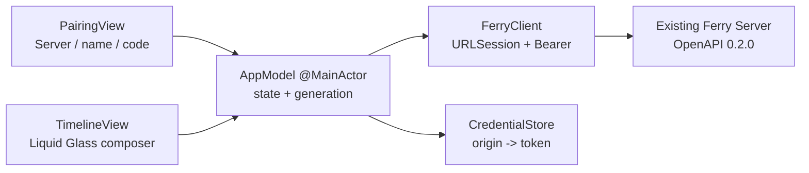

# iOS native vertical slice (historical implementation record)

> English | [简体中文](ios-mvp.zh-Hans.md)

> The admission flow in this document was superseded on 2026-08-30 by `docs/password-access.md`; the current App uses direct connection with an optional shared password.

Status: `implemented — verified`
Confirmation: Max replied `go` to the iOS scope card on 2026-08-30, then explicitly required iOS 26 as the minimum with Liquid Glass by default.

## S0 — Confirmed scope

- **REQUESTED**: continue to the next stage and create the Ferry iOS App; minimum iOS 26, Liquid Glass by default.
- **Done**: in a real iOS Simulator, the user manually enters the Ferry Server address and pairing code, enters the native timeline, and sends text and a file; after the Server revokes the device, the App returns to the pairing state and shows why.
- **DESIGN_NECESSARY**: the device token is stored in Keychain and the Server URL in UserDefaults; otherwise identity or the entry point is lost after relaunching the App.
- **DESIGN_NECESSARY**: Server/credential switches are isolated with a generation + task cancellation; otherwise an old poll/send can overwrite the new session.
- **DESIGN_NECESSARY**: allow local-network HTTP and declare the local-network usage; otherwise the current trusted LAN Server cannot be reached from iOS.
- **REPO_REQUIRED**: SwiftUI, Apple native frameworks, a file-system synchronized Xcode project, separate DerivedData, a single Simulator, unit tests, a real Server + Simulator journey, self-review and independent review.
- **Decided (Max)**: iOS 26; Liquid Glass is the default look, with no iOS 17–25 fallback maintained.
- **Decided (Max via scope `go`)**: no third-party dependencies; Team left empty; temporary Bundle ID `com.max1874.ferry`, release identity to be decided later.
- **Superseded on 2026-09-11 (Max)**: the release identity is now decided, so the "temporary Bundle ID" item no longer holds. The store name is `FerryDrop` and the Bundle ID changes to `com.max1874.ferrydrop` (all three targets together), decided in order to ship TestFlight. The store name `Ferry` is unavailable — 7 locales including `en-US` and `en-GB` are taken by other developer accounts; the lookup record lives in the private account-side knowledge base. This entry applies only to the Bundle ID and release identity; "no third-party dependencies" and "Team left empty" still hold. Note that the Keychain service `com.max1874.ferry.device` in `CredentialStore.swift` is a separate identifier and was not renamed; changing it would make paired devices lose their token.
- **Decided (Max, 2026-09-11)**: iOS versions use the three-part `x.x.x` format starting at `1.0.0`. `MARKETING_VERSION` changes from `0.1.0` to `1.0.0`, because there is no evidence App Store Connect accepts a version whose first part is 0, and an archive takes several minutes, so it is not worth finding out at the upload step. The Android APK v0.1.0 record is an existing fact and unaffected by this entry.
- **Non-goals**: Android, automatic discovery, background clipboard, file preview/download, device management, TLS, public-Internet connections, an offline message cache, push notifications.
- **Superseded on 2026-09-09 (Max)**: "file preview/download" is no longer a non-goal. Core action 3 in `docs/product-core.md` has always included previewing and downloading files; Web and Android later implemented it, and only iOS stopped at this milestone boundary, receiving files it could not save. iOS file cards and the full-screen image viewer now carry a save control, and images render inline on all three platforms. This entry applies only to that item; the rest of this file's non-goals still hold.
- **Depth**: full; a new native client and a cross-process user journey, without changing the existing HTTP contract/schema/auth boundary.
- **Budget**: at most 10 production Swift files and 800 net new lines; one Xcode project, one unit-test target, one UI-test target; no new persistent schema or third-party package.
- **Artifact budget**: this file carries S0–S7; no second summary is created.
- **Execution budget**: use only 1 existing Simulator, never create or delete user devices; commit + push by default after acceptance.
- **Boundary plan**: unit tests use a contract-aware URLProtocol fake to close decode/error/race cases; a real Go Server + iPhone 17 Pro Simulator + XCUITest closes the user-visible Done.
- **Expansion triggers**: API changes, mDNS, TLS, background tasks, a second local database, a share extension or going over budget trigger HALT.

## S1 — Architecture decision

### In three sentences

This stage connects the existing Ferry API to a real SwiftUI App: after pairing, the user sends text and files in a native chat timeline. The Server remains the only authority on messages and identity; iOS stores only a token isolated by Server origin in Keychain, and uses a session generation to stop old asynchronous tasks from writing into new state. If the boundaries are wrong, the user loses their identity, sends content to the wrong Server, or still sees a false online state after being revoked.

### Observed problems

1. **Observed**: the repository has no Xcode project or Swift source, and the existing AppIcon asset has only the mac idiom, so it cannot become the iOS AppIcon directly.
2. **Observed**: the API already provides public claim and Bearer session/messages/text/file; iOS needs no new Server endpoint.
3. **Observed**: the Xcode 26.6 SDK provides `.glassEffect(...)`, `GlassEffectContainer` and `.buttonStyle(.glass/.glassProminent)`; this machine has the iOS 26.5 runtime.
4. **Observed**: avocado/swipe both use objectVersion 77 + a file-system synchronized root group; Ferry adopts the same project shape without copying their Team, Bundle ID or business architecture.

### Candidates

- **A — Native SwiftUI + handwritten narrow client (Selected)**: implement only the 5 APIs this slice uses, with models aligned to OpenAPI's exact keys. Pros: no generator or dependency, and controllable error and cancellation semantics; cost: API extensions must keep model tests in sync.
- **B — OpenAPI generated client (Rejected)**: less hand-writing long term, but the repository has no generator gate, and introducing one adds tooling, generated output and a drift mechanism beyond this slice's budget.
- **C — WKWebView wrapper (Rejected)**: the fastest way to see the existing Web app, but it cannot prove native Keychain, file picking and Liquid Glass interaction, and is not an iOS native slice.

### Authority and lifecycle

| Decision | Authority | Work identity | Ordering | Opens | Closes |
| --- | --- | --- | --- | --- | --- |
| current Server | normalized origin in AppModel | session generation UUID | newest generation only | connect/pair | endpoint change |
| current identity | Server `/session` + Keychain token | origin + token | 401 outranks older success | claim/session 200 | 401/disconnect |
| timeline | Server sequence/cursor | generation + cursor | ascending sequence | authenticated | generation change |
| send terminal state | request task + generation | generation + local send ID | current generation only | user submits | response/error/cancel |
| file bytes lifetime | security-scoped URL | one send task | task-owned | file selected/send | response/error/cancel |

Original counterexample: session A's poll has been sent, the user switches to Server B and finishes pairing, then A returns 401/200. Every switch first increments the generation and cancels the old task; any response compares the generation before changing state and is discarded if it differs, so A has no right to clear or overwrite B.

### Rules and counterexamples

| Rule | Mechanism | Counterexample |
| --- | --- | --- |
| The token never enters UserDefaults or logs | Keychain CredentialStore is the only token writer | a search of defaults/log finds no token key/value |
| The origin carries no credential/path/query | URL normalization at construction | `http://user@10.0.0.1:8080/x?q=1` is rejected |
| Unknown message kinds fail closed | custom Codable enum | `{kind:"link"}` fails to decode |
| Server errors are observable | decode API error, retain user-facing message | 401 → Pairing; 503 → Offline/error, not a false success |
| Old tasks cannot write back | generation check before every mutation | A's delayed result after switching to B is ignored |
| Files obey the 64 MiB contract | preflight resource size + Server enforcement | a 67,108,865-byte file is rejected client-side |
| Liquid Glass is structure, not a decorative screenshot | glass APIs on toolbar/composer/action controls | the source/build gate fails if the glass APIs are missing |

## S2 — Frozen ship checklist

| ID | Provenance | Finite property | Evidence |
| --- | --- | --- | --- |
| IOS-01 | REQUESTED | iOS 26 app project builds with supplied Ferry icon | `xcodebuild build` + installed app icon |
| IOS-02 | DESIGN_NECESSARY | origin validation, Codable contract, API errors and generation isolation | unit tests |
| IOS-03 | DESIGN_NECESSARY | token is origin-keyed in Keychain; URL persists without token leakage | unit tests + source search |
| IOS-04 | REQUESTED | real Simulator pairs with real Server and renders current device/timeline | XCUITest actual labels |
| IOS-05 | REQUESTED | real Simulator sends text and Server-backed timeline renders exact sender/body | XCUITest + Server response/history |
| IOS-06 | REQUESTED | real Simulator selects and sends a file; timeline renders exact name/size | XCUITest + Server history/blob bytes |
| IOS-07 | REQUESTED | Server revocation moves App to pairing with visible reason | real Server + XCUITest |
| IOS-08 | REQUESTED | iOS 26 Liquid Glass controls are present and interactive | source gate + Simulator screenshot/interaction |
| IOS-09 | REPO_REQUIRED | build/test/diff/self-review/fresh review all close on final subject | S3–S7 |

Frozen journey: empty data dir Server prints code → iPhone 17 Pro launches → user enters `http://<private-ip>:<port>`, `iPhone`, code → header shows `iPhone` → send `hello from iOS` → same row shows sender/body → attach `ios-fixture.txt` and send → row shows file name/byte count → another authenticated client revokes iPhone → next poll shows pairing screen and `This device is no longer paired.`

## S3 — Build and attack record

The implementation stayed within budget: 9 production Swift files, 721 lines; no third-party package. The project is Xcode 26.6 / objectVersion 77 / file-system synchronized groups with deployment target iOS 26.0; the App icon is a 1024×1024 iOS asset generated from the user-supplied icon at the repository root.

Counterexamples fossilized during the build:

- An optional from `try?` was bound twice, so the first compile failed; after removing the duplicate binding the same generic Simulator build passed.
- After revocation `pollTask` was only cancelled and its owner not cleared, so re-pairing could not start a new poll; `testPollingRestartsAfterRevocationAndRepair` went red then green.
- A late authentication from Server A could overwrite Server B; `testStaleAuthenticationCannotReplaceNewPairing` fossilizes the generation gate.
- Cancelling the poll on inactive was treated as offline; `testBackgroundCancellationDoesNotTurnConnectedSessionOffline` fossilizes the CancellationError/URLError.cancelled boundary.
- Host case and default ports split one origin into several Keychain accounts; endpoint tests fossilize lowercase hosts and 80/443 normalization.
- Sending a file cleared an existing text draft; `testSendingFilePreservesExistingTextDraft` fossilizes "sending a file does not consume the draft".
- A Keychain save error was wiped by refresh; a separate `credentialWarning` stays visible, fossilized by `testCredentialSaveFailureRemainsVisibleWhileConnected`.
- Send errors and connection errors shared state and were erased by a healthy poll; a separate `sendError` keeps failures, and the offline state offers a Change Server escape.
- Session switching isolated old write-backs but did not stop old I/O; the model owns the send task, reset/inactive cancel it, and files are read in 256 KiB chunks checking cancellation and the 64 MiB limit between chunks.
- A slow successful send cleared a newer draft or attachment; the final design uses independent, monotonically increasing draft/file revisions, closing different values, same-value ABA and cross-field interleaving.
- A 401 from the public pairing claim was once misread as revocation of an authenticated device; the client now produces unauthorized only for a 401 on a request carrying Bearer, and the public claim keeps the Server's `invalid_pairing_code` message.

Seven protocol attacks:

| Pattern | Attack | Outcome / gate |
| --- | --- | --- |
| Two judges | OpenAPI path/method/Bearer/query against Swift requests; Server responses against Codable | URLProtocol asserts requests exactly and the real Server journey decodes successfully; the client deliberately tolerates unknown response keys but is stricter on the discriminator/payload invariant |
| Extremes | empty page, unknown/mismatched kind, 64 MiB + 1 | decoder/empty poll tests; an oversized sparse file fails at the selection boundary |
| Equivalent spellings | `HTTPS://Example.COM:443/`, `:80` | both normalize to a single lowercase origin with the default port removed |
| Defaults | default Server, missing/unknown kind, nil file/text | the UI journey really re-enters the default origin; unknown/mismatched payloads fail closed |
| Side doors | directly constructing a forged `SelectedFile(size: 0)` to bypass the selection preflight | `FerryClient` re-checks the real bytes, and the test forbids the request from reaching URLProtocol |
| Policy needs a gate | iOS 26, Liquid Glass, 10 files/800 LOC, no package | pbx/source/LOC search + build/test commands; any drift produces a visible diff or compile failure |
| No self-certification | the App showing "sent" by itself is not evidence | the Owner API reads the exact sender/text/file, the downloaded blob matches the fixture with `cmp=0`, and after Owner DELETE 204 the XCUITest waits for the real 401 UI |

Known bounded risk: file reading is chunked and cancellable, but the MVP still builds an in-memory multipart body of up to 64 MiB; the limit is enforced by both client and Server, and this stage has no streaming upload. TLS, background transfer and download are out of scope.

## S4 — Adversarial self-review

Conclusion: the author-side gate is **PASS**. Recorded in order 1–13:

1. Coupled state — `generation/token/endpoint/cursor/pollTask/sendTask/isActive/isSending/selectedFile/draftRevision/fileRevision/status` are traced in full; poll repair, stale auth, inactive cancellation and composer ABA/cross-field all have named unit tests.
2. Failure paths — 401, API rejection, invalid decode, Keychain read/save, cancel and oversize are all observable or explicitly ignore cancellation; covered by tests + the real revoke journey.
3. Unchanged callers — `rg 'FerryServicing|CredentialStoring|ServerEndpoint|setActive' ios/Ferry` hits only the App, the single model and test seams; there is no second caller.
4. Contract surfaces — Server/OpenAPI/DB unchanged; URLProtocol asserts `/messages?after=7&limit=200` and Bearer, and the real 0.2.0 Server completes claim/text/file/session.
5. Fix reproduction — the poll restart case was the only failure before the fix and the whole suite passed after; the first Swift compile error passed in the same build afterwards.
6. Current-HEAD journey — after all production fixes, replayed on an ad-hoc signed iPhone 17 Pro/iOS 26.5; Server sequence 11 text and 12 file, exact sender `iPhone UI Test`, downloaded bytes `cmp=0`, DELETE 204, XCUITest 1/1, exit 0.
7. Mechanism discrimination — uses a real Keychain round-trip; a kill probe without signing returns `-34018` and the new warning is visible, so a simulated failure is no longer taken for Keychain success.
8. Regression scan — candidates were a warning hiding revoke, file send losing the draft, and cancel turning offline; closed respectively by a separate warning/reset, the draft test and the cancellation test.
9. Scale/edge — empty timeline, duplicate append, 64 MiB + 1, the forged size side door and invalid origin/kind are covered; streaming is explicitly left for later.
10. Contract attacks — the seven-attack table in S3 records each attack and gate.
11. Predicate producers — every producer of `phase/statusMessage/credentialWarning/ClientError.unauthorized` was reviewed with `rg`; only HTTP 401 produces unauthorized, and the warning does not take part in the auth phase.
12. Reversed findings — Keychain `-34018` is not product success: switched to ad-hoc signing + a real round-trip; the Files fixture was not missing but was an iOS 26 Cell identifier, finally selected by Cell and proven by the Server blob.
13. Pass limit — this record is only an author pre-filter; the S5 fresh verifier is the final independent gate.

## S5/S6 — Independent verification

A fresh zero-context verifier `/root/ios_fresh_review` attacked the complete source repeatedly and raised, then drove to closure: send errors erased by polling, no Change Server escape when offline, security scope acquired too late, old sends not cancelled, slow sends overwriting a newer composer, same-value ABA, cross-field coupling from text and attachment sharing one revision, and confused pairing-401 semantics. The final version uses independent draft/file revisions and distinguishes 401 by whether the request carries Bearer, closing with 18/18 signed Simulator unit tests and the real Server XCUITest. Final verdict: **SHIP, no remaining P0/P1/P2**. Contract parity is unchanged, because this stage did not change `api/openapi.yaml` or Server routes.

## S7 — Closure

- `xcodebuild build` generic iOS Simulator: PASS.
- signed iPhone 17 Pro / iOS 26.5 unit tests: 18/18 PASS.
- current-HEAD real Server journey: text/file API exact, blob `cmp=0`, DELETE 204, XCUITest 1/1 PASS.
- `go test -count=1 ./...`, `go test -race -count=1 ./...`, `go vet ./...`: PASS.
- `plutil -lint`, `git diff --check`: PASS.
- Fresh verdict: SHIP, no remaining P0/P1/P2; the commit and default push are recorded at delivery.
