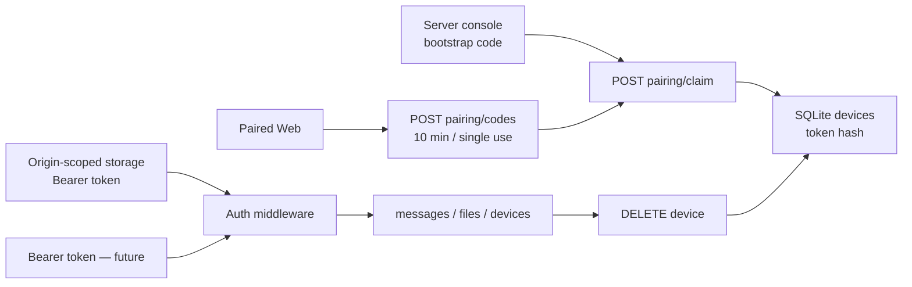

# LAN pairing and authentication slice (historical)

> English | [简体中文](lan-auth.zh-Hans.md)

> Superseded from 2026-08-30 by `docs/password-access.md`. The pairing codes and the `-pair` recovery flag below are no longer part of the current product or API.

Status: `exact_head_approved`  
Confirmation: Max replied `go` on 2026-08-29 after reading the scope card.

## S0 — Confirmed scope

- **REQUESTED**: continue implementing Ferry's cross-device sharing on the LAN.
- **Done**: a second device joins Ferry with a pairing code; unpaired requests are rejected; paired devices can use the existing timeline; a revoked device's token stops working immediately.
- **DESIGN_NECESSARY**: generate a bootstrap code on first start; paired devices can generate short-lived, single-use pairing codes, otherwise new devices have no safe entry.
- **DESIGN_NECESSARY**: every device uses its own random token and the Server persists only a hash; otherwise devices cannot be revoked individually and a database leak exposes credentials directly.
- **DESIGN_NECESSARY**: only an explicit `-lan` allows a non-loopback listener; without that gate a mistyped address widens exposure.
- **DESIGN_NECESSARY**: when device records exist but every client credential is lost, the Server operator can explicitly generate a recovery code with `-pair`; otherwise a self-host is locked out for good.
- **REPO_REQUIRED**: OpenAPI kept in sync with the implementation; fail closed; a real two-device browser journey; race and boundary tests, 1–13 self-review and a fresh verifier.
- **Non-goals**: iOS/Android clients, automatic discovery, accounts/roles, public-Internet exposure, automatic clipboard, TLS, and confidentiality against passive LAN listeners.
- **Depth**: contract; this slice changes authentication, the HTTP contract and the persistent schema.
- **Budget**: at most 8 production files changed and about 900 net new production LOC; one `devices` table and one in-process short-lived pairing-code mechanism; no new third-party dependency.
- **Artifact budget**: this file carries S0–S7; OpenAPI/README are updated in step and no second delivery summary is created.
- **Execution budget**: no deploy, no push; at most 3 ineffective acceptance attempts of the same kind.
- **Boundary plan**: a real Server + two real browser contexts close Done; Go tests close the token/schema/race counterexamples.
- **Expansion triggers**: TLS, mDNS, user roles, remote accounts, a second long-running service or an extra persistent mechanism trigger HALT.

## S1 — Architecture decision

### In three sentences

This slice adds a door to the existing Server: each of your devices first exchanges a one-time code for its own token, and only then can read and write the timeline. The raw token goes only to the device and the Server stores only its hash; the device list and revocation are decided by the same database. If the design is wrong, a stranger's device may read files, revocation may not take effect, or every device may be forced to re-pair after a restart.

### Observed / inferred problems

1. **Observed**: no API currently has authentication; it is closed to the LAN only because the listener is forced onto loopback.
2. **Observed**: messages store the client-supplied `sender_name`; once several devices join, it can be forged.
3. **Inferred**: a shared password cannot revoke one device on its own; storing raw tokens turns a database read into an immediate takeover.
4. **Inferred**: HTTP cookies are not isolated by port and cannot carry Ferry credentials; Web and future native clients both use Bearer, with the Web app keeping it in origin-scoped browser storage.
5. **Decided (Max, scope `go`)**: this slice protects identity inside a trusted LAN and does not promise HTTP transport confidentiality; TLS is a separate later layer.

### Candidates

#### A. Per-device token + bootstrap/short-lived pairing code

- The token is 256-bit random, base64url; SQLite stores only the SHA-256 hash.
- The first device uses the Server console's bootstrap code; afterwards paired devices generate 4-digit ASCII, 10-minute, single-use codes.
- The Web app uses origin-scoped browser storage + Bearer and future native clients reuse Bearer; every request looks up the devices table live.
- **Recommended / Decided (Max, scope `go`)**: satisfies independent identity, persistence across restart and immediate revocation, without an external service.

#### B. One password shared by all devices

- Fewer endpoints, but devices cannot be told apart, listed or revoked individually; changing the password logs out every device.
- **Rejected**: cannot satisfy the confirmed "a revoked device stops working immediately".

#### C. An mTLS certificate per device

- Provides strong client auth as well, but browser certificate import, a self-signed CA and mobile provisioning would become the bulk of the slice.
- **Rejected**: expands into TLS/certificate lifecycle beyond the confirmed scope.

### Authorities and lifecycle

| Decision | Authority | Identity / ordering | Opens | Closes |
| --- | --- | --- | --- | --- |
| whether a request may access protected APIs | SQLite `devices.token_hash` | SHA-256(raw token) unique | device INSERT commit | device DELETE commit |
| whether a pairing code can be claimed | PairingManager mutex + hash map | normalized code hash + issuer device ID | code generated | first claim, 10-minute expiry or issuer revoked |
| who the message sender is | authenticated Device snapshot | device ID | auth succeeds | request ends |
| whether a LAN listener is allowed | CLI `-lan` + actual bound address | process config | startup validation | process exit |
| whether recovery is possible after credentials are lost | the Server operator's CLI `-pair` | a new code for the current process | explicit start | claim or expiry |

Original race: A and B submit the same pairing code at the same time. Under the mutex only the first claim can reserve it; after the database succeeds, commit deletes it, and on failure rollback allows a retry. The second concurrent claim gets `invalid_pairing_code` and no second device is created.

### Contract rules and counterexamples

| Rule | Mechanism | Discriminating counterexample |
| --- | --- | --- |
| Protected APIs require a valid device | Bearer auth middleware with a live hash lookup | `GET /api/v1/messages` without Authorization → 401 |
| Cookies cannot become a cross-port side door | the Server accepts only Bearer, and claim sets no cookie | a request with only a `ferry_device` cookie → 401; claim has no Set-Cookie |
| The raw token never touches disk | returned only in the claim response after generation; DB stores the hash | searching SQLite for the raw token finds nothing |
| Codes are single-use and time-limited | mutex atomic consume + expiry | a second claim of the same code / an expired claim → 401 |
| Revocation cannot be bypassed by a pre-issued code | codes record their issuer; DELETE invalidates the issuer's unconsumed codes in the same step | B generates a code, A revokes B, claiming that code → 401 |
| The sender cannot be forged | requests no longer accept `sender_name`; the auth Device.Name is used | a body with `sender_name=Admin` → 400 |
| Revocation takes effect immediately | every request queries the DB, no auth cache | the old Bearer's next request after DELETE → 401 |
| The system cannot be revoked down to zero devices | the API does not allow revoking the current device; the SQLite DELETE requires more than one device before deleting | two devices revoking each other concurrently still leave one |
| LAN must be switched on explicitly and bound to a specific private IP | `-lan` gate + listener/Host validation; wildcard fails closed | `-lan -listen 0.0.0.0:8080` → fails to start |
| Recovery codes do not leak by default | generated only when devices=0 or with explicit `-pair` | an ordinary restart with devices prints no code; `-pair` prints one |
| Browser writes must be same-origin | the existing Origin gate stays in force | evil Origin + valid Bearer → 403 |

### First consumers — frozen journeys

1. **Bootstrap (Server console + browser A)**: after starting with an empty data dir a code appears on the console; A opens the Web app and sees the pairing form, submits the code + `Max Mac`, and the page enters an empty timeline; the expected session device name is `Max Mac`.
2. **Pair second device (browser A + isolated browser B)**: A generates a code; B submits `iPhone` + the code and enters the same timeline; A sends `from mac`, and after polling B sees the same body with sender `Max Mac`.
3. **Unauthorized / replay kill probe (browser/API)**: an unpaired context's list request gets 401; resubmitting the code B already consumed gets `invalid_pairing_code`, and the device count does not increase.
4. **Revoke (browser A/B)**: A revokes `iPhone` in the devices UI; B's next poll turns into Pair required and can no longer list/send; A still works.
5. **Restart (Server + browser A)**: restarting with the same data dir produces no bootstrap code; A's origin-scoped Bearer stays valid, and history and device identity are kept.

## S2 — Frozen ship checklist

| ID | Provenance | Finite property | Machine/runtime check |
| --- | --- | --- | --- |
| AUTH-01 | DESIGN_NECESSARY | additive devices schema; raw token never touches disk | store tests + SQLite query |
| AUTH-02 | DESIGN_NECESSARY | code single-use/expiry/concurrent claim | deterministic manager tests + race |
| AUTH-03 | DESIGN_NECESSARY | protected APIs 401; headers do not downgrade; Origin still rejected | HTTP contract tests |
| AUTH-04 | DESIGN_NECESSARY | sender comes only from the authenticated device | body/multipart spoof tests |
| AUTH-05 | REQUESTED | bootstrap and second-device pairing really work | journeys 1–2, reading page content |
| AUTH-06 | REQUESTED | the old token fails immediately after revoke | store/HTTP tests + journey 4 |
| AUTH-07 | REQUESTED | auth and messages survive restart | persistence test + journey 5 |
| AUTH-08 | DESIGN_NECESSARY | non-loopback starts only under `-lan`; Host restricted; lost credentials recover only through explicit `-pair` | config/run/Host tests + CLI probes |
| AUTH-09 | REPO_REQUIRED | OpenAPI, README, Web and implementation agree | contract review + browser journey |
| AUTH-10 | REPO_REQUIRED | budget, tests/race/vet/diff, self-review and fresh verdict all closed | S3–S7 evidence |

2×2 contract freeze: OpenAPI loosen/tighten and implementation loosen/tighten are all watched by exact request/response key tests and the old `sender_name` rejection fixture; the repository has no second-language binding yet, so cross-runtime acceptance is carried by the OpenAPI artifact + the browser consumer.

## S3 — Build and attack record

Build epoch 8. Epochs 1–3 fixed the listener, pre-issued code, cookie, download, revocation race, Storage and claim rollback problems from fresh #1/#2; epoch 4 fixed fresh #3's session auto-recovery and the `<a>` download side door. Fresh #4 then confirmed that a stale requester could revoke other devices, the send button did not refresh after an auth switch, and the storage warning was erased by send status; epoch 5 closed them with a requester-conditional DELETE, a unified composer refresh and a separate `storageError`. Fresh #5 confirmed that an authenticated but subsequently revoked slow request could still land a message, and that a new identity inherited the old draft/file; epoch 6 bound the message's final INSERT and device liveness into the same SQLite statement, and cleared the tab's draft and file when the credential was cleared. Fresh #6 found in turn that an old tab would delete, and then overwrite, a newer same-origin tab's credential; epochs 7/8 finally limited persistence of the shared token to a successful pairing claim, with 401/session recovery changing only the current tab's memory and UI. No new persistence, service or third-party dependency.

### Seven attack patterns

1. **Dual judges**: OpenAPI and Go both judge pairing claim; lowercase codes + surrounding Unicode whitespace are normalized by the implementation, with the OpenAPI description updated to match; duplicate/escaped keys are rejected by `TestHTTPAuthRejectsDuplicateCredentialsAndMalformedPairingJSON`.
2. **Extremes**: `TestPairingCodeExpiresAndRejectsEquivalentLookingInput` covers the exact expiry boundary; `TestCreateDeviceValidatesNameBoundaries` covers 64±1 UTF-8 bytes, empty values and control characters; `TestDeviceTokenRequiresCanonical256Bits` covers missing bytes, padding and non-tokens.
3. **Equivalent spellings**: lowercase pairing codes, `bearer  <token>`, `device_name`/`device_name` duplicate keys and multiple `Origin` headers each have an HTTP test; the results are explicit normalization or failing closed respectively.
4. **Defaults as backdoors**: `TestConfigRequiresExplicitLANModeAndPrivateAddress` proves `-lan=false` cannot listen on private addresses and even `-lan=true` rejects IPv4/IPv6 wildcards; `TestPairingCodeIssuancePolicy` proves `-pair=false` prints no credential when devices already exist.
5. **Side doors**: `TestEveryProtectedAPIRouteRejectsUnpairedRequests` walks the actual `/api/v1/` route group and unknown routes; the HTTP journey confirms legacy cookies cannot authenticate, claim sets no cookie, pre-issued codes die with their issuer, and the old `sender_name` cannot forge either.
6. **Policy needs a gate**: real v8 binary kill probes: `-lan -listen 0.0.0.0:18097` and `-lan -listen 8.8.8.8:18097` both exit 1 with `loopback, or a private/link-local IP address`; the specific `10.0.0.13:18097` starts successfully, with no listener fallback.
7. **No self-certification**: a real Server + separate BrowserContexts created over CDP and two same-origin tabs completed claim/send/upload/download/revoke/re-pair/restart; after the old tab got a real 401 with the revoked token, the new tab's shared token was neither deleted nor overwritten, and a reload still restored the new identity.

### Final-HEAD runtime transcript

> This section is the historical acceptance record from the 16-character code era; the raw codes in it only prove what ran at the time. The current 4-digit contract and new evidence are in `docs/four-digit-pairing.md`.

- Binary: `/private/tmp/ferry-auth-v8.BOHukN/ferry`; SHA-256 `e9995a86d93cb8663104ebc9cdda1deb1b0170fe4d5b245f4ba174341c66f7f5`. Recording: `<browser-harness recordings>/ferry-lan-auth-v8`, 134 frames.
- With Storage forced to throw `SecurityError` by a new-document script, the page still showed Pair required; submitting bootstrap showed only the storage error, then A paired successfully with the same code, proving the failure did not consume the code.
- The Server was bound explicitly to `10.0.0.13:18097`; A/B paired as `Max Mac`/`Owner iPhone`. A sent text and uploaded `roundtrip.txt` (40 B); B saw the same sender/body in sync and downloaded through a button via Bearer fetch→Blob; source and download SHA-256 were both `b535a483…0b745`, `cmp` exit 0.
- B's first `/session` in a new document was injected with 503: the page really showed Offline with token length still 43, and returned to Local after 2.5 seconds without a reload. With `Storage.setItem` forced to fail, the warning stayed visible after a successful send.
- `Max Mac` generated `PJQAJLYLEL4KFLIV` and prepared a text draft and a file; after Owner revoked it, the tab really showed Pair required, an empty draft, files=0 and send disabled, and claiming the old code again showed invalid/expired. The old raw token could remain in origin storage as powerless data, and was overwritten by the new token after successfully claiming `Repaired Mac`.
- A second same-origin tab was deliberately frozen in the old `Max Mac` in-memory identity; released after shared storage already held the new `Repaired Mac` token, the old tab's real messages request got 401 and its in-memory token was cleared, while the shared token stayed byte-for-byte the new value. After reload the new tab was still `Repaired Mac` with all three history entries.
- An ordinary restart with the same data dir printed no bootstrap; `Repaired Mac`/`Owner iPhone` automatically restored identity and the three history entries. Explicit `-pair` printed `KH3J27BXNJLDQZOG`, which a new separate context actually claimed as `Recovery Browser` and read the three history entries.
- Listener kill probes: both the wildcard and public commands exit 1, and no corresponding data dir is created. The final full machine gate results are recorded in S7.
- Budget: 8 production files; 1,097 additions - 84 deletions = 1,013 net new production LOC (113% of the original "about 900" estimate, without breaking the hard 8-file boundary); no new third-party dependency.

## S4 — Adversarial self-review

Conclusion: **epoch 8 author pass = ship candidate; the final green is closed jointly by fresh #6's sealed code verdict + S6 parity + the finite S7 checklist**. All intermediate conclusions of fresh #1–#6 are kept; after the epoch 8 fixes, this pass restarted from a complete reread of adversarial-self-review.

1. **Coupled state**: `PairingManager.codes(expiry/issuer/reserved)` is decided by one mutex; DB devices/messages are linearized by a single-statement EXISTS. The Web app's tab-local `deviceToken/currentDevice/authGeneration/authController/loading/sessionLoading` and origin-shared localStorage are listed separately; only a successful claim writes shared storage, a 401 clears only the tab-local credential, and offline `clearCredential=false` changes neither. Evidence: `rg 'removeItem|storeToken\(|showApp\(|showPairing\('` shows the credential `storeToken` only in its definition + claim.
2. **Failure paths**: a claim DB failure rolls back; file read/size/sync/INSERT failures all delete the blob; when a device is revoked during a slow upload the final INSERT returns ErrUnauthorized and cleans the blob. Evidence: `TestPairingClaimDatabaseFailureRollsBackCode`, `TestRevokingDeviceDuringFileUploadPreventsMessageAndBlob`, `go test -race -count=1 ./internal/ferry` all `ok`.
3. **Unchanged callers**: `rg 'CreateTextForDevice|CreateFileForDevice|CreateText\(|CreateFile\('` shows production HTTP calls only the device-bound versions, and the legacy API is used only by old store tests/migration; all Go tests `ok`.
4. **Contract surfaces**: OpenAPI declares only Bearer and the request schema has no sender; HTTP tests assert claim has no cookie, cookie-only 401, exact response keys, spoofed sender 400 and stale create 401.
5. **Original reproduction**: every confirmed counterexample from fresh #1–#5 has a fossil; this round replayed a gated reader letting a file copy start→DELETE commit→continue the copy, yielding ErrUnauthorized, 0 messages and 0 blobs. The real UI had B hold text+file first and then be revoked; both ended empty.
6. **Journey at current runtime**: production hash `e9995a86…66f7f5`; the 134-frame v8 recording covers storage denial, A/B pairing, text/file, Bearer download, session outage recovery, persistent storage warning, revoke/stale code, draft isolation, same-origin stale-tab 401, new-token reload, restart and a real `-pair` claim.
7. **Mechanism discrimination**: after the storage probe fails the same bootstrap code still succeeds; the downloaded artifact is `cmp`'d; revocation kills the token's permission, the issuer's codes and the tab-local draft together; the slow-reader fossil proves the decision happens at the end of the write; a private listener succeeds while wildcard/public exit 1 on the same binary.
8. **Regression scan**: candidate regression one was an old raw token lingering after 401 and overreaching; the real old token still gets only 401, and a new claim overwrites it. Candidate regression two was offline recovery wrongly writing the shared token; `showApp` no longer has a token parameter/write, and after a real 503 the token length is 43 and recovery is automatic. A real 401's tab-local UI demonstrably clears draft/file; the storage warning stays visible after a successful send.
9. **Scale/edge**: the 64 MiB file and 200-message page limits are unchanged; zero devices, 64±1 name bytes, the expiry instant, 32 concurrent claims, cross revocation and revocation during slow upload all have deterministic tests; there is no tenant surface.
10. **Seven contract attacks**: all seven S3 items were replayed in epoch 8; this round's new defense (claim-only shared-token writer) was attacked recursively with two same-origin tabs + a real revoke/401, the old tab had no delete/overwrite ability, and no mock fallback was used.
11. **Predicate producers**: `ErrUnauthorized` is produced by the requester-conditional DELETE and the device-conditional message INSERT, and handlers map it uniformly to 401; `clearCredential=false` is produced only by the transient `loadSession` catch; the only write producer of the shared token is the claim response `payload.token`. grep and `TestWebClientOnlyPersistsDeviceTokenAfterSuccessfulClaim` agree.
12. **Reversed findings**: fresh #4's requester/sibling write is now closed by the DELETE/text/file conditions; fresh #5's in-flight text/file and composer sibling are both closed; fresh #6's delete/overwrite shared-storage siblings were both removed, session/showApp/401/offline act only on tab-local state, and claim is the only writer.
13. **Pass limit**: AUTH-01…10 is a finite checklist; the author pass does not replace the verifier. Fresh #6's sealed verdict is SHIP (no P0/P1) and S6 parity PASS; the final per-item status is in S7.

## S5/S6 — Independent verification

S5 code-only fresh review #1: `/root/lan_auth_fresh`, zero conversation context, modelled from complete files and the old HEAD implementation, without reading this document/README/product-core; sealed verdict = **No-ship, 3×P1**.

1. A wildcard listener exposes every interface, and a forged private Host cannot stand in for the actual local-address boundary; fixed by forbidding wildcards and requiring a specific private/link-local IP, permanently fossilized in config tests + a CLI probe.
2. A revoked device could re-pair with a code issued beforehand; fixed by binding codes to their issuer + revoke invalidation, permanently fossilized in the manager/HTTP journey + a real BrowserContext stale-code probe.
3. HTTP cookies are not isolated by port, so other services on the same host could receive the token; fixed with Bearer-only + origin-scoped storage, permanently fossilized by claim having no Set-Cookie, cookie-only 401 and a real browser's `document.cookie == ""`.

S5 code-only fresh review #2: `/root/lan_auth_fresh_v2`, likewise zero context and without reading documents; sealed verdict = **No-ship, 2×P1 + 2×P2**.

1. P1: a localStorage Bearer does not flow into an `<a>` download automatically; fixed with authenticated fetch→Blob, fossilized by a real click + `cmp`.
2. P1: an old request could NewCode after the revoke scan; fixed by rechecking the issuer in the DB after NewCode, with the claim's issuer liveness and INSERT decided atomically by the same SQLite statement.
3. P2: Storage throwing led to a blank page / a lost token after pairing; fixed with get/set/remove catch, a writable probe before claim, and, in extreme races, keeping the in-memory token + an observable warning.
4. P2: a code was consumed permanently before the DB succeeded; fixed with reserve/commit/rollback, and a canceled-context HTTP test proves the original code can be retried after failure.

S5 code-only fresh review #3: `/root/lan_auth_fresh_v3`, zero context and without reading documents; sealed verdict = **SHIP, no P0/P1, 2×P2**. The P2s were no self-recovery after a transient startup session failure, and middle/right-click on the file `<a>` carrying no Bearer. Epoch 4 fixed them with single-flight session polling + a generation gate when a token is present, and a button file card with no href; a real browser injected an outage and recovered without reload, the AX tree confirmed a button, and the download `cmp` passed.

S5 code-only fresh review #4: `/root/lan_auth_fresh_v4`, zero context; sealed verdict = **No-ship, 1×P1 + 2×P2**. The P1 was that a stale requester context could revoke other devices; the P2s were the send button staying disabled after an auth switch, and a successful send erasing the storage warning. All three were fossilized in stale DELETE HTTP/store tests, a real composer-switch journey and a separate-error-state journey.

S5 code-only fresh review #5: `/root/lan_auth_fresh_v5`, zero context; sealed verdict = **No-ship, 1×P1 + 1×P2**. The P1 was that after a request passed auth, a slow text/file could land after device revocation completed; fixed with a device-conditional final INSERT and fossilized by a gated-reader concurrency test. The P2 was a new identity inheriting the old identity's draft/file; fixed by resetting the composer in step with credential clear, fossilized by a real revoke/re-pair journey.

S5 code-only fresh review #6: `/root/lan_auth_fresh_v6`, zero context and with four documents excluded up front. The first round confirmed 1×P1: an old same-origin tab's 401 would unconditionally delete the new tab's shared token; after removing the delete it disproved again with a sibling P1: the old tab's session recovery would overwrite the new token with the old valid one. Epoch 8 narrowed the persistent writer to a successful claim, fossilized in `TestWebClientOnlyPersistsDeviceTokenAfterSuccessfulClaim`; after the verifier rechecked every producer the sealed verdict = **SHIP (no P0/P1)**.

S6 parity: only after the code verdict was sealed did the same verifier read `docs/lan-auth.md`, README, product-core and OpenAPI, checking them item by item against handler/store/CLI/Web/tests; verdict = **PASS (no P0/P1 contract mismatch)**. It noted that OpenAPI expresses a few response enums/input constraints incompletely, which is non-blocking and does not affect current API/security/product semantics.

## S7 — Closure

Status: `exact_head_approved`.

| Checklist | Result | Evidence |
| --- | --- | --- |
| AUTH-01 | PASS | hash-only persistence + migration/store tests |
| AUTH-02 | PASS | expiry/replay/concurrent reserve tests + race |
| AUTH-03 | PASS | protected-route/header/cookie/Origin HTTP tests |
| AUTH-04 | PASS | sender spoof rejection + authenticated sender journeys |
| AUTH-05 | PASS | v8 bootstrap + second isolated BrowserContext |
| AUTH-06 | PASS | stale Bearer/code + in-flight gated upload + real revoke |
| AUTH-07 | PASS | same-data restart restores identity/messages/files |
| AUTH-08 | PASS | explicit LAN/private bind, wildcard/public kill, real `-pair` claim |
| AUTH-09 | PASS | S6 parity PASS + v8 Web journey |
| AUTH-10 | PASS | full tests/race/vet/node/YAML/diff + fresh SHIP |

Delivery in three sentences: this slice makes every Ferry device pair first and then use its own token to access the shared timeline. The Server stores only token hashes, can revoke devices, blocks final writes already in flight, and supports explicit recovery; browser tabs do not delete or overwrite each other's new identity. If these mechanisms fail, strangers' or revoked devices may read or write shared content, or users may lose their only credential during normal use.
