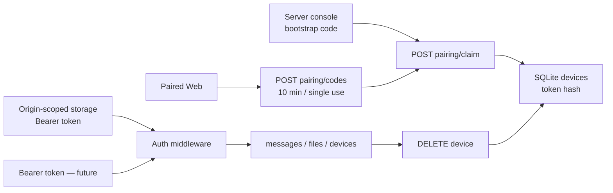

# LAN 配对与鉴权纵切（历史）

> 2026-08-30 起由 `docs/password-access.md` 取代。下文的配对码和 `-pair` 恢复参数不再属于当前产品或 API。

状态：`exact_head_approved`  
确认依据：Max 在 2026-08-29 阅读 scope card 后回复 `go`。

## S0 — Confirmed scope

- **REQUESTED**：继续实现 Ferry 的局域网跨设备共享。
- **Done**：第二台设备通过配对码加入 Ferry；未配对请求被拒绝；配对设备能使用现有时间线；设备被撤销后 token 立即失效。
- **DESIGN_NECESSARY**：首次启动生成 bootstrap code；已配对设备可生成短期、单次配对码，否则新设备没有安全入口。
- **DESIGN_NECESSARY**：每台设备使用独立随机 token，Server 只持久化 hash，否则不能单独撤销且数据库泄漏会直接暴露 credential。
- **DESIGN_NECESSARY**：只有显式 `-lan` 才允许非 loopback listener；没有这个 gate，拼错地址就会扩大暴露面。
- **DESIGN_NECESSARY**：有设备记录但所有客户端 credential 丢失时，Server 操作者可用 `-pair` 显式生成恢复码，否则 self-host 会永久锁死。
- **REPO_REQUIRED**：OpenAPI 与实现同步；失败关闭；真实浏览器双设备旅程；race、边界测试、1–13 自审与 fresh verifier。
- **Non-goals**：iOS/Android 客户端、自动发现、账号/角色、公网暴露、自动剪贴板、TLS 和对局域网被动监听者的机密性。
- **Depth**：contract；本纵切改变鉴权、HTTP 合约和持久化 schema。
- **Budget**：最多改动 8 个 production files，production 净新增约 900 LOC；一个 `devices` 表和一个进程内短期配对码机制；不新增第三方依赖。
- **Artifact budget**：本文件同时承载 S0–S7；同步更新 OpenAPI/README，不新建第二份交付总结。
- **Execution budget**：不部署、不 push；最多 3 次同类无效验收尝试。
- **Boundary plan**：真实 Server + 两个真实 browser context 关闭 Done；Go tests 关闭 token/schema/竞态反例。
- **Expansion triggers**：TLS、mDNS、用户角色、远程账户、第二个常驻服务或额外持久机制触发 HALT。

## S1 — Architecture decision

### 三句话说明

这一纵切给现有 Server 加一扇门：每台自己的设备先用一次性代码换取独立 token，此后才能读写时间线。token 的原文只交给设备，Server 只保存 hash；设备列表和撤销都由同一个数据库裁决。如果设计错误，陌生设备可能读取文件、撤销可能不生效，或者重启后所有设备被迫重新配对。

### Observed / inferred problems

1. **Observed**：当前所有 API 无鉴权；只因 listener 强制 loopback 才不向局域网开放。
2. **Observed**：消息保存客户端提供的 `sender_name`；一旦多设备接入，它可被伪造。
3. **Inferred**：共享密码不能单独撤销一台设备；原始 token 入库会把数据库读取升级为立即接管。
4. **Inferred**：HTTP cookie 不按端口隔离，不能承载 Ferry credential；Web 与未来 native 均使用 Bearer，Web 存在按 origin 隔离的 browser storage。
5. **Decided（Max，scope `go`）**：本纵切保护可信 LAN 内的身份，不承诺 HTTP 传输机密性；TLS 是后续独立层。

### Candidates

#### A. 独立设备 token + bootstrap/短期配对码

- token 256-bit 随机、base64url；SQLite 只存 SHA-256 hash。
- 首台设备用 Server console 的 bootstrap code；以后由已配对设备生成 4 位 ASCII 数字、10 分钟、单次 code。
- Web 用 origin-scoped browser storage + Bearer，未来 native 复用 Bearer；每次请求实时查 devices 表。
- **Recommended / Decided（Max，scope `go`）**：满足独立身份、重启持久化和立即撤销，且不引入外部服务。

#### B. 所有设备共享一个密码

- 更少 endpoint，但无法辨别、列出或单独撤销设备；改密会让所有设备下线。
- **Rejected**：不能满足已确认的“设备撤销后立即失效”。

#### C. 每台设备 mTLS certificate

- 同时提供强 client auth，但浏览器证书导入、自签 CA 和移动端 provisioning 会成为本纵切主体。
- **Rejected**：扩张到 TLS/证书生命周期，超过已确认范围。

### Authorities and lifecycle

| Decision | Authority | Identity / ordering | Opens | Closes |
| --- | --- | --- | --- | --- |
| 请求能否访问受保护 API | SQLite `devices.token_hash` | SHA-256(raw token) 唯一 | device INSERT commit | device DELETE commit |
| pairing code 能否认领 | PairingManager mutex + hash map | normalized code hash + issuer device ID | code 生成 | 首次 claim、10 分钟到期或 issuer 被撤销 |
| 谁是消息 sender | 已鉴权 Device snapshot | device ID | auth 成功 | request 结束 |
| LAN listener 是否允许 | CLI `-lan` + 实际 bound address | process config | 启动验证 | process 退出 |
| credential 丢失后能否恢复 | Server 操作者的 CLI `-pair` | 当前 process 的新 code | 显式启动 | claim 或到期 |

原竞态：A、B 同时提交同一个 pairing code。mutex 下只有第一个 claim 能 reserve；数据库成功后 commit 删除，失败则 rollback 允许重试。第二个并发 claim 得到 `invalid_pairing_code`，不会创建第二台设备。

### Contract rules and counterexamples

| Rule | Mechanism | Discriminating counterexample |
| --- | --- | --- |
| 受保护 API 必须有有效设备 | Bearer auth middleware 实时 hash lookup | 无 Authorization 的 `GET /api/v1/messages` → 401 |
| cookie 不能成为跨端口旁路 | Server 仅接受 Bearer，claim 不设 cookie | 只有 `ferry_device` cookie 的请求 → 401；claim 无 Set-Cookie |
| token 原文不落盘 | 生成后只向 claim response 返回；DB 存 hash | 在 SQLite 搜索 raw token 无结果 |
| code 单次、限时 | mutex 原子 consume + expiry | 同码第二次 claim / 过期 claim → 401 |
| 撤销不能被预签发 code 绕过 | code 记录 issuer；DELETE 后同步作废 issuer 未消费 codes | B 生成 code，A 撤销 B，该 code 再 claim → 401 |
| sender 不能伪造 | request 不再接受 `sender_name`；取 auth Device.Name | body 带 `sender_name=Admin` → 400 |
| 撤销立即生效 | 每请求查 DB，不做 auth cache | DELETE 后旧 Bearer 下一请求 → 401 |
| 系统不能撤销到零设备 | API 不允许撤销当前设备；SQLite DELETE 要求删除前多于一台 | 两台设备并发交叉撤销，最终仍有一台 |
| LAN 必须显式开启且绑定具体私网 IP | `-lan` gate + listener/Host validation；wildcard 失败关闭 | `-lan -listen 0.0.0.0:8080` → 启动失败 |
| 恢复码不能默认泄露 | 仅 devices=0 或显式 `-pair` 时生成 | 已有设备的普通重启不打印 code；`-pair` 会打印 |
| browser write 必须同源 | 现有 Origin gate继续生效 | evil Origin + 有效 Bearer → 403 |

### First consumers — frozen journeys

1. **Bootstrap（Server console + browser A）**：空 data dir 启动后 console 出现 code；A 打开 Web 看见 pairing form，提交 code + `Max Mac`，页面进入空时间线；预期 session device name 为 `Max Mac`。
2. **Pair second device（browser A + isolated browser B）**：A 生成 code；B 提交 `iPhone` + code，进入同一时间线；A 发送 `from mac`，B 在 polling 后看见相同正文且 sender 为 `Max Mac`。
3. **Unauthorized / replay kill probe（browser/API）**：未配对 context 请求 list 得 401；B 已消费的 code 再提交得到 `invalid_pairing_code`，devices 数量不增加。
4. **Revoke（browser A/B）**：A 在 devices UI 撤销 `iPhone`；B 下一次 poll 变为 Pair required，不能再 list/send；A 仍可使用。
5. **Restart（Server + browser A）**：同 data dir 重启且不产生 bootstrap code；A 的 origin-scoped Bearer 继续有效，历史和 device identity 保留。

## S2 — Frozen ship checklist

| ID | Provenance | Finite property | Machine/runtime check |
| --- | --- | --- | --- |
| AUTH-01 | DESIGN_NECESSARY | additive devices schema；raw token 不落盘 | store tests + SQLite query |
| AUTH-02 | DESIGN_NECESSARY | code single-use/expiry/concurrent claim | deterministic manager tests + race |
| AUTH-03 | DESIGN_NECESSARY | 受保护 API 401；header 不降级；Origin 仍拒绝 | HTTP contract tests |
| AUTH-04 | DESIGN_NECESSARY | sender 只来自 authenticated device | body/multipart spoof tests |
| AUTH-05 | REQUESTED | bootstrap 与第二设备配对真实可用 | journey 1–2，读取页面内容 |
| AUTH-06 | REQUESTED | revoke 后旧 token 立即失败 | store/HTTP tests + journey 4 |
| AUTH-07 | REQUESTED | auth 与消息在重启后保留 | persistence test + journey 5 |
| AUTH-08 | DESIGN_NECESSARY | 非 loopback 仅在 `-lan` 下启动；Host 限定；credential 丢失只能由显式 `-pair` 恢复 | config/run/Host tests + CLI probes |
| AUTH-09 | REPO_REQUIRED | OpenAPI、README、Web 与实现一致 | contract review + browser journey |
| AUTH-10 | REPO_REQUIRED | budget、tests/race/vet/diff、自审、fresh verdict 全关闭 | S3–S7 evidence |

2×2 contract freeze：OpenAPI loosen/tighten 与 implementation loosen/tighten 都由 exact request/response key tests 和旧 `sender_name` rejection fixture 监测；本仓库尚无第二语言 binding，跨运行时验收由 OpenAPI artifact + browser consumer承担。

## S3 — Build and attack record

构建 epoch 8。epoch 1–3 修复 fresh #1/#2 的 listener、预签发 code、cookie、下载、撤销竞态、Storage 和 claim rollback 问题；epoch 4 修复 fresh #3 的 session 自动恢复与 `<a>` 下载旁路。fresh #4 又确认 stale requester 可撤销其他设备、auth 切换后发送按钮不刷新、storage warning 被发送状态擦除；epoch 5 以 requester-conditional DELETE、统一 composer refresh、分离 `storageError` 收口。fresh #5 确认已鉴权但随后被撤销的慢请求仍可落消息，以及新身份会继承旧草稿/文件；epoch 6 将消息最终 INSERT 与 device 存活绑定到同一 SQLite statement，并在 credential 清除时清空 tab 内草稿和文件。fresh #6 先后发现旧 tab 会删除、再会覆盖同 origin 新 tab 的 credential；epoch 7/8 最终将共享 token 的持久化唯一限定在成功 pairing claim，401/session recovery 只改变当前 tab 内存与 UI。无新持久化、服务或第三方依赖。

### Seven attack patterns

1. **Dual judges**：OpenAPI 与 Go 同判 pairing claim；小写 code + Unicode 外围空白被实现归一化，OpenAPI 说明同步；重复/转义键由 `TestHTTPAuthRejectsDuplicateCredentialsAndMalformedPairingJSON` 拒绝。
2. **Extremes**：`TestPairingCodeExpiresAndRejectsEquivalentLookingInput` 覆盖精确到期边界；`TestCreateDeviceValidatesNameBoundaries` 覆盖 64±1 UTF-8 bytes、空值和 control character；`TestDeviceTokenRequiresCanonical256Bits` 覆盖缺字节、padding 和非 token。
3. **Equivalent spellings**：小写 pairing code、`bearer  <token>`、`device_name`/`device\u005fname` 重复键、多 `Origin` 都有独立 HTTP test；结果分别是明确归一化或失败关闭。
4. **Defaults as backdoors**：`TestConfigRequiresExplicitLANModeAndPrivateAddress` 证明 `-lan=false` 不能监听 private，即使 `-lan=true` 也拒绝 IPv4/IPv6 wildcard；`TestPairingCodeIssuancePolicy` 证明已有设备时 `-pair=false` 不打印 credential。
5. **Side doors**：`TestEveryProtectedAPIRouteRejectsUnpairedRequests` 遍历实际 `/api/v1/` route group 和 unknown route；HTTP journey 确认 legacy cookie 不能认证、claim 不设 cookie、预签发 code 随 issuer 撤销失效，旧 `sender_name` 也不能伪造。
6. **Policy needs a gate**：v8 binary 真实 kill probes：`-lan -listen 0.0.0.0:18097` 与 `-lan -listen 8.8.8.8:18097` 均 exit 1，输出为 `loopback, or a private/link-local IP address`；具体 `10.0.0.13:18097` 则成功启动，没有 listener fallback。
7. **No self-certification**：真实 Server + CDP 创建的独立 BrowserContext 和同-origin双 tab 完成 claim/send/upload/download/revoke/re-pair/restart；旧 tab 用撤销 token 得到真实 401 后，新 tab 的 shared token 未被删除或覆盖，reload 仍恢复新身份。

### Final-HEAD runtime transcript

> 本节是 16-character code 时代的历史验收记录，其中 code 原文只证明当时运行结果；当前 4 位数字契约与新证据见 `docs/four-digit-pairing.md`。

- Binary：`/private/tmp/ferry-auth-v8.BOHukN/ferry`；SHA-256 `e9995a86d93cb8663104ebc9cdda1deb1b0170fe4d5b245f4ba174341c66f7f5`。录制：`<browser-harness recordings>/ferry-lan-auth-v8`，134 frames。
- Storage 被新文档脚本强制抛 `SecurityError` 时仍显示 Pair required；提交 bootstrap 只显示 storage error，随后 A 用同码成功配对，证明失败没有消耗 code。
- Server 明确绑定 `10.0.0.13:18097`；A/B 分别配对为 `Max Mac`/`Owner iPhone`。A 发送文本并上传 `roundtrip.txt` (40 B)，B 同步看见相同 sender/body，并由 button 经 Bearer fetch→Blob 下载；源/下载 SHA-256 均为 `b535a483…0b745`，`cmp` exit 0。
- B 新文档的首个 `/session` 被注入 503：页面实显 Offline、token 长度仍 43，2.5 秒后无 reload 回到 Local。强制 `Storage.setItem` 失败后，警告在成功发送消息后仍保持可见。
- `Max Mac` 生成 `PJQAJLYLEL4KFLIV` 并准备文本草稿和文件；Owner 撤销后，该 tab 实显 Pair required、草稿空、files=0、send disabled，旧 code 再 claim 实显 invalid/expired。旧 raw token 作为无权数据可留在 origin storage，成功 claim `Repaired Mac` 后被新 token 覆盖。
- 同 origin 第二 tab 被刻意冻结在旧 `Max Mac` 内存身份；shared storage 已是 `Repaired Mac` 新 token 后再放行，旧 tab 的真实 messages 请求 401、内存 token 清空，但 shared token byte-for-byte 保持新值。新 tab reload 后仍为 `Repaired Mac`，三条历史完整。
- 同 data dir 普通重启未打印 bootstrap；`Repaired Mac`/`Owner iPhone` 自动恢复 identity 与三条历史。显式 `-pair` 打印 `KH3J27BXNJLDQZOG`，新的独立 context 实际领取为 `Recovery Browser` 并读到三条历史。
- Listener kill probes：wildcard/public 两条命令均 exit 1；没有创建对应 data dir。完整机器门禁在 S7 记录最终结果。
- Budget：8 个 production files；1,097 additions - 84 deletions = production 净新增 1,013 LOC（原“约 900”估算的 113%，未突破 8-file 硬边界）；无新第三方依赖。

## S4 — Adversarial self-review

结论：**epoch 8 author pass = ship candidate；最终 green 由 fresh #6 sealed code verdict + S6 parity + S7 有限 checklist 共同关闭**。fresh #1–#6 的中间结论全部保留；epoch 8 修复后重新完整读取 adversarial-self-review 开始本 pass。

1. **Coupled state**：`PairingManager.codes(expiry/issuer/reserved)` 由同一 mutex 裁决；DB 的 devices/messages 由单 statement EXISTS 线性化。Web 的 tab-local `deviceToken/currentDevice/authGeneration/authController/loading/sessionLoading` 与 origin-shared localStorage 已分别列出；只有 successful claim 写 shared storage，401 只清 tab-local credential，offline `clearCredential=false` 两者都不改。证据：`rg 'removeItem|storeToken\(|showApp\(|showPairing\('` 显示 credential `storeToken` 仅 definition + claim 两处。
2. **Failure paths**：claim DB 失败 rollback；file read/size/sync/INSERT 失败都删除 blob；device 在慢 upload 期间撤销时最终 INSERT 返回 ErrUnauthorized 且清 blob。证据：`TestPairingClaimDatabaseFailureRollsBackCode`、`TestRevokingDeviceDuringFileUploadPreventsMessageAndBlob`、`go test -race -count=1 ./internal/ferry` 均 `ok`。
3. **Unchanged callers**：`rg 'CreateTextForDevice|CreateFileForDevice|CreateText\(|CreateFile\('` 显示 production HTTP 只调用 device-bound 版本，legacy API 仅旧 store tests/迁移使用；所有 Go tests `ok`。
4. **Contract surfaces**：OpenAPI 仅声明 Bearer，request schema 不含 sender；HTTP tests 断言 claim 无 cookie、cookie-only 401、exact response keys、spoof sender 400、stale create 401。
5. **Original reproduction**：fresh #1–#5 已确认反例均有 fossil；本轮原样用 gated reader 让 file copy 开始→DELETE commit→继续 copy，得到 ErrUnauthorized、0 message、0 blob。真实 UI 让 B 先持有文本+文件再被撤销，终态两者均空。
6. **Journey at current runtime**：production hash `e9995a86…66f7f5`；134-frame v8 记录覆盖 storage denial、A/B 配对、text/file、Bearer download、session outage recovery、persistent storage warning、revoke/stale code、draft isolation、同-origin stale-tab 401、新 token reload、restart 与真实 `-pair` claim。
7. **Mechanism discrimination**：storage probe 失败后同 bootstrap code 仍成功；download 点击产物 `cmp`；撤销同时杀 token 的权限、issuer code 和 tab-local draft；慢 reader fossil 证明裁决发生在写入末端；private listener 成功而 wildcard/public 同 binary exit 1。
8. **Regression scan**：候选回归一是 401 后旧 raw token 留存导致越权；真实旧 token 仍只得到 401，新 claim 会覆盖它。候选回归二是 offline 恢复误写 shared token；`showApp` 已无 token 参数/写入，真实 503 后 token 长度 43 且自动恢复。真正 401 的 tab-local UI 实证 draft/file 清空；成功发送后 storage warning 仍可见。
9. **Scale/edge**：64 MiB file 与 200-message page limit 未改；zero devices、64±1 name bytes、expiry instant、32 并发 claim、交叉撤销、慢 upload 撤销都有 deterministic tests；无 tenant surface。
10. **Seven contract attacks**：同文 S3 的七项均在 epoch 8 重放；本轮新 defense（claim-only shared-token writer）由两个 same-origin tab + 真 revoke/401 递归攻击，旧 tab 无删除/覆盖能力，未走 mock fallback。
11. **Predicate producers**：`ErrUnauthorized` 由 requester-conditional DELETE 与 device-conditional message INSERT 产生，handlers 一律映射 401；`clearCredential=false` 只由 transient `loadSession` catch 产生；shared token 的唯一写 producer 是 claim response `payload.token`。grep 与 `TestWebClientOnlyPersistsDeviceTokenAfterSuccessfulClaim` 同判。
12. **Reversed findings**：fresh #4 的 requester/sibling write 现由 DELETE/text/file 条件闭合；fresh #5 的 in-flight text/file 与 composer sibling 均闭合；fresh #6 的 delete/overwrite 两个 shared-storage sibling 均被移除，session/showApp/401/offline 只作用 tab-local state，claim 是唯一 writer。
13. **Pass limit**：AUTH-01…10 是有限 checklist；author pass 不替代 verifier。fresh #6 sealed verdict 为 SHIP (no P0/P1)，S6 parity PASS；最终逐项状态见 S7。

## S5/S6 — Independent verification

S5 code-only fresh review #1：`/root/lan_auth_fresh`，零对话上下文，按完整文件及 HEAD 旧实现建模，未读本文档/README/product-core；sealed verdict = **No-ship, 3×P1**。

1. wildcard 监听暴露所有接口，伪造 private Host 不能代替实际 local-address 边界；修复为禁止 wildcard，必须绑定具体 private/link-local IP，并永久 fossil 到 config tests + CLI probe。
2. 撤销设备仍能用事先签发 code 重新配对；修复为 code issuer 绑定 + revoke invalidation，永久 fossil 到 manager/HTTP journey + 真 BrowserContext stale-code probe。
3. HTTP cookie 不按端口隔离，同 host 其他服务可收到 token；修复为 Bearer-only + origin-scoped storage，永久 fossil 到 claim 无 Set-Cookie、cookie-only 401 和真浏 `document.cookie == ""`。

S5 code-only fresh review #2：`/root/lan_auth_fresh_v2`，同样零上下文且未读文档；sealed verdict = **No-ship, 2×P1 + 2×P2**。

1. P1：localStorage Bearer 不会自动进入 `<a>` download；修复为 authenticated fetch→Blob，真实点击 + `cmp` fossil。
2. P1：旧请求可在 revoke 扫描后 NewCode；修复为 NewCode 后 DB issuer 复查，且 claim 的 issuer 存活与 INSERT 由同一 SQLite statement 原子裁决。
3. P2：Storage 抛异常导致空白页/配对后丢 token；修复为 get/set/remove catch、claim 前 writable probe，以及极端 race 下保留 in-memory token + 可观察警告。
4. P2：code 在 DB 成功前永久 consume；修复为 reserve/commit/rollback，canceled-context HTTP test 证明失败后原 code 可重试。

S5 code-only fresh review #3：`/root/lan_auth_fresh_v3`，零上下文且未读文档；sealed verdict = **SHIP，无 P0/P1，2×P2**。P2 是启动 session 瞬时失败后不自恢复、以及 file `<a>` 的中键/右键无 Bearer。epoch 4 修复为 token-present 时 single-flight session polling + generation gate，以及无 href 的 button file card；真浏注入 outage 无 reload 恢复，AX tree 确认 button 且下载 `cmp` 通过。

S5 code-only fresh review #4：`/root/lan_auth_fresh_v4`，零上下文；sealed verdict = **No-ship，1×P1 + 2×P2**。P1 是 stale requester context 能撤销其他设备；P2 是 auth 切换后 send button 仍 disabled，以及成功发送会擦除 storage warning。三项分别 fossil 到 stale DELETE HTTP/store tests、真实 composer switch 旅程和分离错误状态旅程。

S5 code-only fresh review #5：`/root/lan_auth_fresh_v5`，零上下文；sealed verdict = **No-ship，1×P1 + 1×P2**。P1 是请求先通过 auth 后，慢 text/file 可在设备撤销完成后落库；修复为 device-conditional final INSERT，并以 gated reader 并发 test fossil。P2 是新身份继承旧身份的 draft/file；修复为 credential clear 同步重置 composer，并以真实 revoke/re-pair journey fossil。

S5 code-only fresh review #6：`/root/lan_auth_fresh_v6`，零上下文且先排除四份文档。首轮确认 1×P1：旧同-origin tab 的 401 会无条件删除新 tab 的 shared token；移除 delete 后又反证出 sibling P1：旧 tab 的 session recovery 会把旧有效 token 覆盖新 token。epoch 8 将 persistent writer 收窄到成功 claim，并 fossil 到 `TestWebClientOnlyPersistsDeviceTokenAfterSuccessfulClaim`；verifier 复查全量 producer 后 sealed verdict = **SHIP（no P0/P1）**。

S6 parity：同一 verifier 在 code verdict sealed 后才读取 `docs/lan-auth.md`、README、product-core、OpenAPI，并逐项与 handler/store/CLI/Web/tests 核对；verdict = **PASS（no P0/P1 contract mismatch）**。它注明 OpenAPI 有少量非阻断的响应枚举/输入约束表达不完备，不影响当前 API/security/product 语义。

## S7 — Closure

状态：`exact_head_approved`。

| Checklist | Result | Evidence |
| --- | --- | --- |
| AUTH-01 | PASS | hash-only persistence + migration/store tests |
| AUTH-02 | PASS | expiry/replay/concurrent reserve tests + race |
| AUTH-03 | PASS | protected-route/header/cookie/Origin HTTP tests |
| AUTH-04 | PASS | sender spoof rejection + authenticated sender journeys |
| AUTH-05 | PASS | v8 bootstrap + second isolated BrowserContext |
| AUTH-06 | PASS | stale Bearer/code + in-flight gated upload + real revoke |
| AUTH-07 | PASS | same-data restart恢复 identity/messages/files |
| AUTH-08 | PASS | explicit LAN/private bind, wildcard/public kill, real `-pair` claim |
| AUTH-09 | PASS | S6 parity PASS + v8 Web journey |
| AUTH-10 | PASS | full tests/race/vet/node/YAML/diff + fresh SHIP |

三句话交付说明：这一纵切让 Ferry 的每台设备先配对，再用独立 token 访问共享时间线。Server 只保存 token hash，可撤销设备、阻断已在途的最终写入，并支持显式恢复；浏览器多 tab 不会互相删除或覆盖新身份。如果这些机制失效，陌生或已撤销设备可能读取/写入共享内容，或用户可能在正常操作后丢失唯一 credential。
